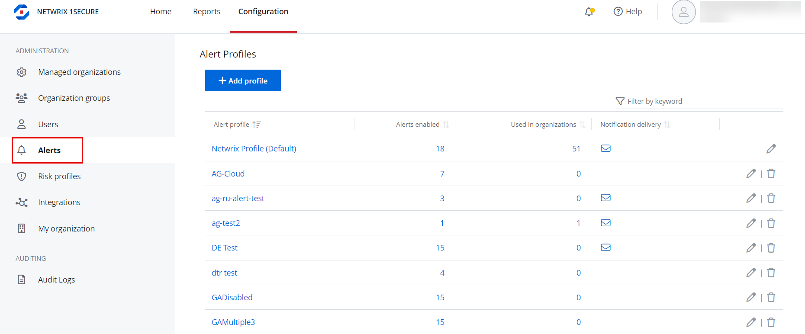
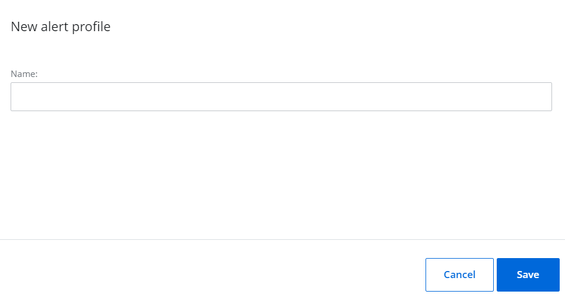
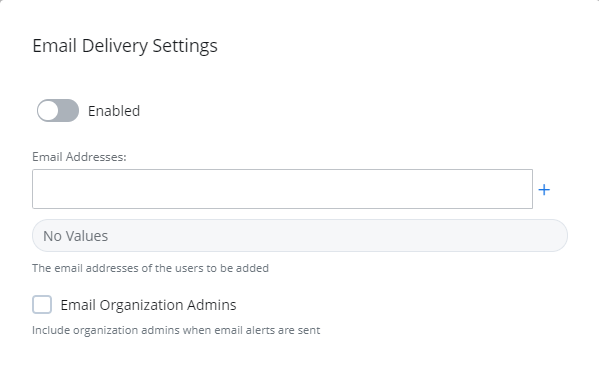

# Alert Profiles

Alert profiles provide a way to easily group alert configurations and delivery notification settings together. You can create an alert profile, enable relevant alerts for the profile, and assign it to organization(s). Additionally, you can customize delivery settings and specify which user(s) will receive notifications when alerts in the profile are triggered.

To view the alert profiles, navigate to Configuration &gt; Alerts.

Alert profiles are displayed in the list with the following information:

- Alert profile   – The name of the alert profile
- Alerts enabled  – The number of alerts enabled for the profile
- Used in organizations  – The number of organizations the alert profile is applied to
- Notification delivery  – Indicates whether email notifications are configured for the profile

The alert profile named *Netwrix Profile (Default)* is available by default and is automatically applied to all managed organizations.

## Add an Alert Profile 

Follow the steps to add an alert profile.

Navigate to Configuration &gt; Alerts. 

Click **Add profile**. The New alert profile pane is displayed.

Enter a name for the alert profile in the Name field and click **Save**. 

The alert profile is added to the list. You can:

- Assign this profile to an organization. You can do this when creating a new organization or editing an organization. See the [Add Organizations](../Organizations/AddOrganizations.md)  topic for additional information.
- Click the profile to review the list of alerts, enable the desired alerts, make necessary edits for alerts, and set delivery settings for the alert profile. See the [Alerts](/Admin/Alerts/Alerts.md)  topic for additional information.

## Modify the Name of an Alert Profile

Follow the steps to modify the name of an alert profile. @Snippet:1Secure/Alert Profiles:AlertProfileNavigation@

Click the Edit icon for an alert profile. The Edit alert profile pane is displayed.

Modify the name of the profile.

Click **Save**.

## Delete an Alert Profile

(1) The alert profile named *Netwrix Profile (Default)* cannot be deleted.   
(2) When  an alert profile is deleted, the *Netwrix Profile (Default)* is automatically assigned to the organizations that were previously assigned the deleted profile.

Follow the steps to delete an alert profile. @Snippet:1Secure/Alert Profiles:AlertProfileNavigation@

Click the Delete icon for an alert profile to delete it.  A dialog box is displayed, prompting you to confirm the deletion of the profile.

Click **Yes**. The alert profile is deleted from the system.

## Manage Delivery Settings for an Alert Profile 

You can receive alerts by email or through the third-party ticket service, as used by the Managed Service Providers.

Follow the steps to  configure alerts by email.

. @Snippet:1Secure/Alert Profiles:AlertProfileNavigation@

Click an alert profile. The alerts for the profile are displayed in a list.

Click the Email icon under Delivery Settings. The Email Delivery Settings pane is displayed.

. Toggle the Enabled switch to ON to enable email notifications for the alert profile.

In the Email Addresses field, enter the email address of a recipient for alert notifications and click the Add icon. To specify multiple email addresses, add them one by one.

Check the **Email Organization Admins** check box to send the alerts to all the organization admins by email.

Click Save.

You may also link to a third-party ticketing system. See the [Third-party systems](../../Integration/README.md)  topic for additional information.