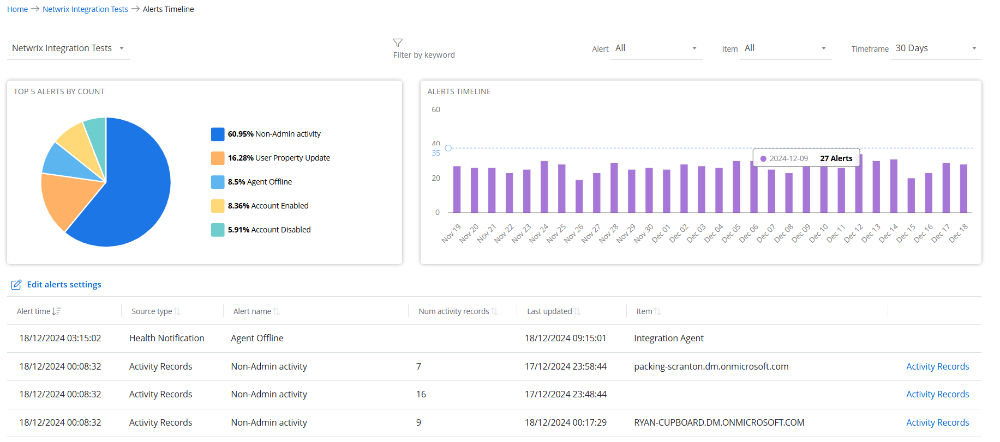

# Alerts Timeline

The Alerts Timeline page provides a view of triggered alerts. It highlights key statistics, including the top 5 alert types by count and a timeline chart to visualize alerts triggered over time. The page also displays a complete list of generated alerts for thorough analysis and monitoring.

To access the Alerts Timeline page, click **Home** at the top and do one of the following:

- On the Top 5 Organizations with Most Alerts chart, click a bar. It opens the Alerts Timeline page that displays alert-related data for the organization represented by the selected bar.
- On the Top 5 Triggered Alerts by Type chart, click a bar. It opens the  Alerts Timeline page that displays alert-related data for all managed organizations.
- In the organizations list, click an organization name to navigate to the Organization Statistics page, then click the Alerts Timeline chart. It opens the Alerts Timeline page that displays alert-related data for the organization selected in the organizations list. @Snippet:1Secure/Dashboard:ManagedUserInsight@ @Snippet:1Secure/Dashboard:ManagingUserInsight@
        
Top 5 Alerts by Count

This card displays a pie chart illustrating the five most frequently triggered alert types. Each slice represents the share of an alert type relative to the others. Hover over a slice to view the exact number of alerts for that type.  
The legend maps the colors used in the pie chart to the names of the alert types along with the share percentage.

Click an alert type on the legend to disable it. Disabled alert types are not displayed in the pie chart. Hence, the pie chart displays only the enabled alert types and their percentage shares with respect to each other. You can click a disabled alert type on the legend to enable it.

Alerts Timeline

This card displays a bar chart illustrating the number of alerts triggered for the period selected in the timeframe drop-down menu. Hover over a bar on the chart to view the exact number of alerts triggered on any specific date.

Alerts List

This section lists all the triggered alerts with the following information:

- Organization – Displays the name of the organization the alert belongs to. Click an organization name to view its alert-related data on the Alerts Timeline page. On filtering data by organization, the Organization column is hidden from the Alerts list.
- Alert time – Displays the date and time when the alert is  triggered
- Source type – Displays the origin or type of data that triggers the alert. Source types are:

    - Activity Records – Alerts generated based on user activities or actions
    - Health Notifications – Alerts related to system performance, for example, when {{ MyVariables.ProductName_Overlord }} is unable to communicate with Netwrix Cloud Agent.
- Alert name – Displays the name of the alert
- Num activity records – Displays the number of activity records associated with the triggered alert, based on the threshold value set for it. The threshold is the minimum number of activity records that must occur within a specified time frame (threshold period) to trigger an alert.
- Last updated – <madcap:annotation madcap:createdate="2025-01-22T20:20:01.2545436+05:00" madcap:creator="HassaanKhan" madcap:initials="HA" madcap:comment="Discussion required as I did not get an information on this." madcap:editor="HassaanKhan" madcap:editdate="2025-01-22T20:20:48.3233059+05:00">Displays the date and time when the alert is trigge</madcap:annotation>red, based on the threshold value set for it. The threshold is the minimum number of activity records that must occur within a specified time frame (threshold period) to trigger an alert.last updated.
- Item – Displays the name of the entity by which the alert is grouped, such as a computer, file, user, etc.
- Activity Records – Click the Activity Records link for an alert to navigate to the Activity page, where you can view a detailed report for that alert type. See the [Activity Reports](../SearchAndReports/Activity.md)  topic for additional information.

Click a column header to sort data in the alerts list by that column in ascending order. An arrow appears next to the column name to indicate the sort order. Click the column header again to sort the data in descending order.

Edit Alerts Settings

Click the **Edit Alerts Settings** link to navigate to the Alerts page, where you can create a new alert and modify existing ones. See the [Alerts](../Alerts/Alerts.md)  topic for additional information.

## Filter Data @Snippet:1Secure/Dashboard:FilterData@

- Organizations – Select an organization from the Organizations drop-down menu to view its alert-related data.
- @Snippet:1Secure/Dashboard:FilterKeyword@ The Alerts list displays the data that matches the specified keyword.
- Alert – Select an alert type from the Alert drop-down menu. The charts and the alerts list display data specific to the selected alert type. By default, All is selected.
- Item – Select an item from the Item drop-down menu. The  charts and the alerts list display alert data specific to the selected item. By default, All is selected.
- @Snippet:1Secure/Dashboard:Timeframe@

    - 7 Days
    - 30 Days
    - 90 Days