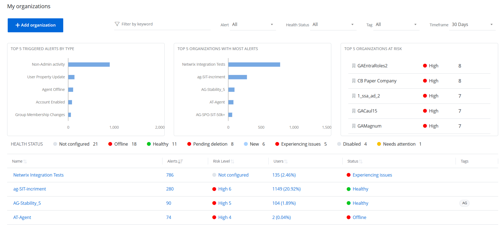

# 1Secure Dashboard

The {{ MyVariables.ProductName_Overlord }} dashboard provides an intuitive, single-pane-of-glass view of your clients organizations, enabling managing organizations, such as Managed Service Providers (MSPs), to quickly identify and prioritize what requires immediate attention. It displays the alerts triggered by specific events, offering drill-down capabilities that enable you to access detailed information on specific alerts and issues, ensuring timely and effective responses. See the [Alerts](../Alerts/Alerts.md)  topic for additional information on alerts.

Click **Home** at the top of the page to access the dashboard. This page is also the default landing page of the application when you sign in. @Snippet:1Secure/Dashboard:ManagedUserInsight@ 
See the [Organization Statistics](/Admin/Dashboard/OrganizationStatistics.md)  topic for additional information. @Snippet:1Secure/Dashboard:ManagingUserInsight@

Top 5 Triggered Alerts by Type

This card displays a bar chart that highlights the five most frequently triggered alert types. Hover over a bar  to view the exact number of alerts for that type. Click a bar to navigate to the Alerts Timeline page. See the [Alerts Timeline](/Admin/Dashboard/AlertsTimeline.md)  topic for additional information.

Top 5 Organizations with Most Alerts

This card displays a bar chart that highlights the five organizations with the highest number of triggered alerts. Hover over a bar to view the exact number of alerts triggered for that organization. Click a bar to navigate to the Alerts Timeline page. See the [Alerts Timeline](/Admin/Dashboard/AlertsTimeline.md)  topic for additional information.

Top 5 Organizations at Risk

This card lists the five organizations with the highest risk levels. Each record includes the organization’s name, <madcap:annotation madcap:createdate="2025-01-21T14:56:37.1197015+05:00" madcap:creator="HassaanKhan" madcap:initials="HA" madcap:comment="Will update this after updating the relevant Risks documentation, and link it to relevant topic." madcap:editor="HassaanKhan" madcap:editdate="2025-01-21T14:57:21.6193025+05:00">risk level, and risk value.</madcap:annotation> Click a record to navigate to the Risk Assessment page. See the [Risk Assessment Dashboard](../RiskProfiles/RiskAssessmentDashboard.md)  topic for additional information.

Health Status

This bar lists the different health statuses assigned to organizations in the Organizations list, along with the number of organizations associated with each status.

Organizations List

This section lists all managed organizations with the following information:

- Name – Displays the name of an organization. Click an organization name to navigate to the Organization Statistics page. See the [Organization Statistics](/Admin/Dashboard/OrganizationStatistics.md)  topic for additional information.

- Alerts – Displays the total number of alerts triggered for the organization. Click the value to navigate to the Alerts Timeline page. See the [Alerts Timeline](/Admin/Dashboard/AlertsTimeline.md)  topic for additional information.
- Risk Level – Displays the risk level for the organization <madcap:annotation madcap:createdate="2025-01-21T15:17:53.2338062+05:00" madcap:creator="HassaanKhan" madcap:initials="HA" madcap:comment="Will update this after updating the relevant Risks documentation, and link it to relevant topic." madcap:editor="HassaanKhan" madcap:editdate="2025-01-21T15:17:54.8790926+05:00">such as, high,</madcap:annotation> medium, or low. Click the value to navigate to the Risk Assessment page. See the [Risk Assessment Dashboard](../RiskProfiles/RiskAssessmentDashboard.md)  topic for additional information.
- Users – Displays @Snippet:1Secure/Dashboard:UserCount@
- Status – Displays @Snippet:1Secure/Dashboard:OrgStatus@ Click the value to navigate to the Health Status for Organization: <madcap:annotation madcap:createdate="2025-01-23T13:35:43.3499360+05:00" madcap:creator="AyeshaAzeem" madcap:initials="AY" madcap:comment="Provide a cross reference to the [age" madcap:editor="AyeshaAzeem" madcap:editdate="2025-01-23T13:35:56.2173923+05:00">&lt;organization name&gt; pane.</madcap:annotation>
- Tags – Displays the user defined tag(s) applied to the organization.

            <madcap:change madcap:changes="untracked">Click a column header to sort the data in the organizations list by that column in ascending order. An arrow appears next to the column name to indicate the sort order. Click the column header again to sort the data in descending order.</madcap:change>

            <madcap:change madcap:changes="untracked">Add Organization</madcap:change>

Click the Add Organization button to add  a new organization. See the [Add Organizations](../Organizations/AddOrganizations.md)  topic for additional information.

## Filter Data @Snippet:1Secure/Dashboard:FilterData@

Some filters apply to all data displayed on this page, while others are specific to the Organizations list.

- @Snippet:1Secure/Dashboard:FilterKeyword@ The Organizations list displays the data that matches the specified keyword.
- Alert – Select an alert type from the Alert drop-down menu. The organizations with alerts triggered for the selected type are displayed in the list. By default, All is selected.
- Health Status – Select a health status from the Health Status drop-down menu. The organizations with the selected heath status are displayed in the list. By default, All is selected . Other statuses <madcap:annotation madcap:createdate="2025-01-23T13:43:24.1309283+05:00" madcap:creator="AyeshaAzeem" madcap:initials="AY" madcap:comment="Explain each status" madcap:editor="AyeshaAzeem" madcap:editdate="2025-01-23T13:43:31.5969844+05:00">are</madcap:annotation>:

    - Healthy
    - Trial in Progress
    - New
    - Update Recommended
    - Needs attention
    - Experiencing Issues
    - Offline
    - Disabled
    - Not configured
    - Pending deletion
- Tag – Select a tag from the  Tag drop-down menu. The bar charts and the organizations list on the dashboard display data for the organizations the tag is associated with. By default, All is selected.
- @Snippet:1Secure/Dashboard:Timeframe@

    - 7 Days
    - 30 Days
    - 90 Days
    - 365 Days