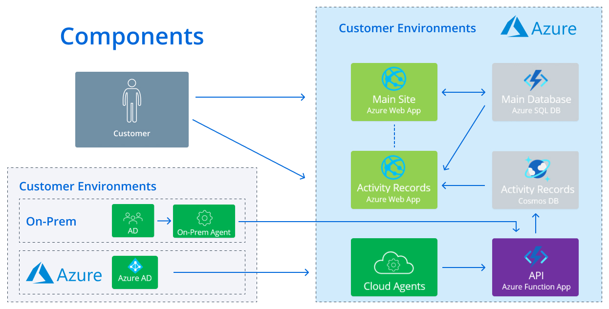

#  How it works

{{ MyVariables.ProductName_Overlord }} is a Microsoft Azure hosted, multi-tenant SaaS application that provides a single location to manage both on-premises and cloud environments. Solution architecture and components interactions are shown in the figure below.

{{ MyVariables.ProductName_Overlord }} On-Prem Agent is a lightweight Windows service which you deploy <madcap:annotation madcap:createdate="2022-06-16T13:08:37.4952149+04:00" madcap:creator="avolkova" madcap:initials="AV" madcap:comment="On the computer where..?" madcap:editor="avolkova" madcap:editdate="2022-06-16T13:08:45.0312326+04:00">in your network.</madcap:annotation> The agent collects aggregated data from your on-premises {{ MyVariables.ProductName_Overlord }}API and/or  uploads the data to your {{ MyVariables.ProductName_Overlord }} tenant via REST API calls over HTTPS every 15 minutes.

{{ MyVariables.ProductName_Overlord }}API or Azure Function App  receives the data from {{ MyVariables.ProductName_Overlord }} On-Prem Agent. Token-based authentication is used for verification between the {{ MyVariables.ProductName_Overlord }} API and the agent. The service behind the Netwrix stores the data in the Azure SQL Database. The data is segregated by tenant (organization). 

All the activity records are stored in the Cosmos Database. The configuration settings, source management, alerts are stored in the Main Database. 

{{ MyVariables.Website }} is the presentation layer of the product that retrieves data from the Azure SQL database and presents it to users. Users can access this web portal with their corporate credentials using Azure AD Authentication (OAuth 2.0). Data is retrieved via API calls made on the user's behalf.