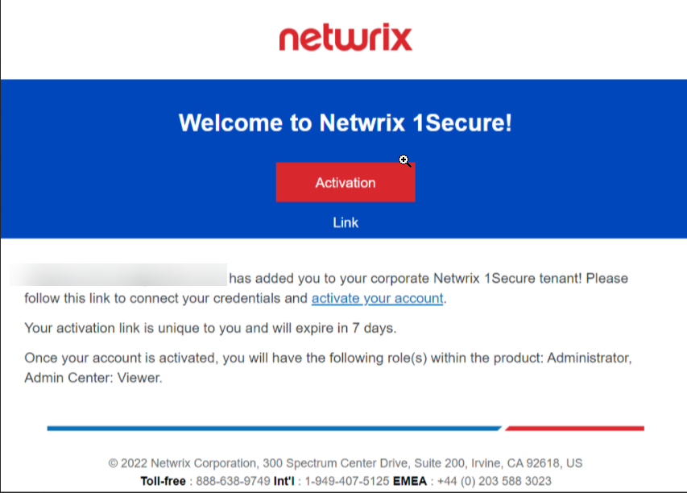
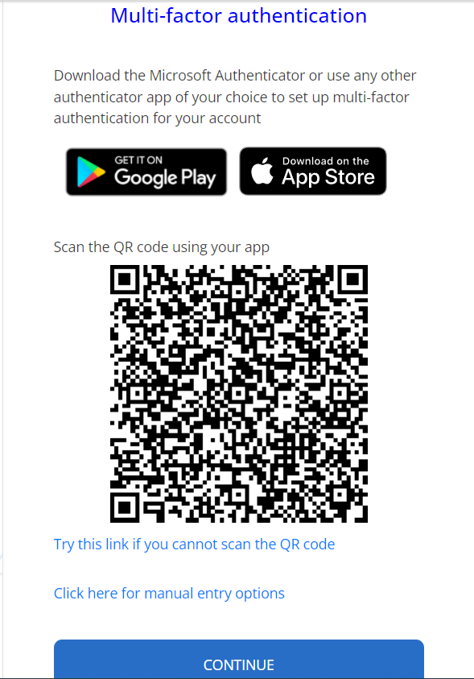
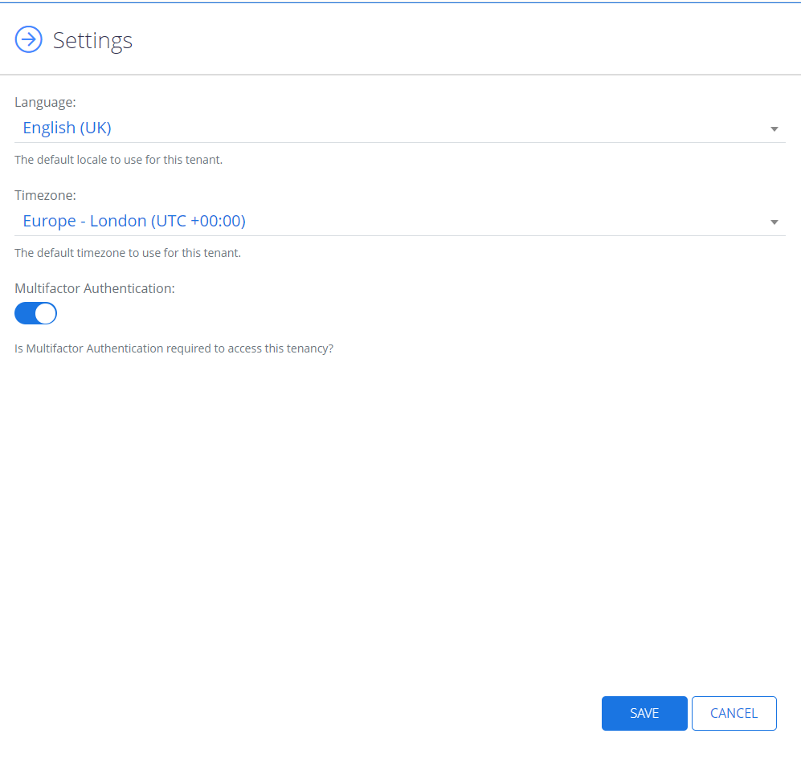

# Log in to Netwrix 1Secure

Once the Netwrix team has created a new tenant for your organization, you will receive an email invitation with the subject line  Netwrix 1Secure – Account Created sent from email address &lt;noreply-1secure@netwrix.com&gt;.

This email includes a unique access link to product’s web portal. You need to activate your account via the link within 7 days. If it expires, you will need to follow the link and request a new activation link.

Follow the steps to authorize in {{ MyVariables.ProductName_Overlord }} with multi-factor authentication.

During the first logon you will be prompted to authorize with multi-factor authentication in case it is enabled for your tenant. It shows a randomly generated and frequently changing code to use for authentication in your Authenticator app.

On the main starting page, select **Log in**.

Specify email, you would like to authorize with, and select **Continue**.

Specify the password and select Log In. 

Enter the verification code from your Authenticator app from your device.

You should install the Microsoft Authenticator app.

Choose the organization which is registered with your account. 

You are ready to go!

## Disable a Multifactor Authentication

Follow the steps to disable Multifactor authentication.

Go to **Configuration** &gt; **My Organizations** &gt; **Edit Settings**. 

Turn off the slider for the Multifactor Authentication.

Click **Save**. 

The Multifactor Authentication is now disabled. 

To learn how to add organizations and install an agent, see the [Add Organizations](Organizations/AddOrganizations.md)  topic for additional information.