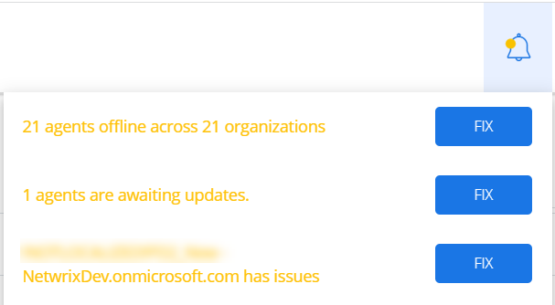

# Notifications 

{{ MyVariables.ProductName_Overlord }} provides real-time notifications to the users, which report on various issues for the user. This includes an agent update, issues with organizations, status of the organizations, expired credentials, and others. 

| Icon | Description |
| --- | --- |
|    | Bell icon. Click the Bell icon to look for the updates. |

Follow the steps to review notifications.

Click the **Bell** icon in the upper right corner of your screen. 

You can select and fix any of the issues on the displayed panel.

Select **Fix**. 

See the following topic for additional information:

- [Update Netwrix Cloud Agent](/Admin/UpdateNetwrixCloudAgent.md) 