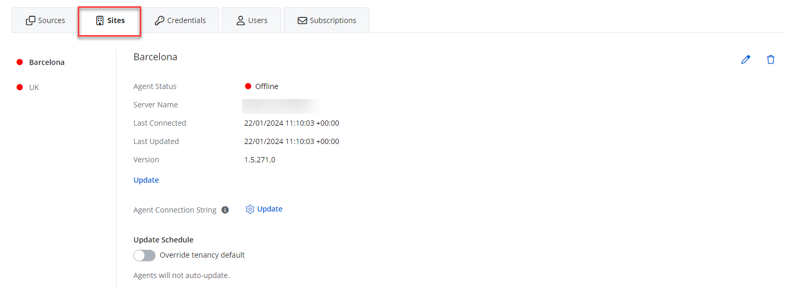

# Add Sites to an Organization

Sites are used to signify physical groupings within the organization.
The feature is helpful for Managed Service Providers with clients in multiple office locations from different cities.   Once they set up an organization, install an agent for the on-prem sources (Active Directory or Computer), you can track the agent status for the organization's site, the agent connection, server name, and check for the agent updates. 

| Icon | Description |
| --- | --- |
|    | Edit Icon. Click the Edit Icon to edit the site details. |
|  | Add Icon. Click the Add Icon to add a site. |
| | Bin Icon. Click the Bin Icon to delete a site. |

## Add a New Site

Follow the steps to add a site to your organization. 

Add your organization or add a source to the created organization. See the [Add Organizations](/Admin/Organizations/AddOrganizations.md)  topic for additional information. 

You can add sites only for on-prem sources - Active Directory and Computer. These sources require an installation of the agent. See the [Add a Computer Source and Connectors](SourcesAndConnectors/ActiveDirectory.md) topic for additional information.

On the Configure source details window (Step 2 of 3) window, add a new site. In the "New site name" field, specify the name for your site. This could be a geographical location like 'Barcelona' or a cluster of servers from which a single agent collects data. Click **Next**.

You can add multiple sites and then add it to your source. A managed organization can have multiple sites and each site can be associated with multiple sources. 

Finish adding a source for your organization. See the [Add a Source and Connectors for Computer](SourcesAndConnectors/ActiveDirectory.md)  topic for additional information.

The site is now added. 

You can now add the created sites to your source. 

Add a source to the your organization.

Select your site from the drop-down list or click the **Add** icon, if your want to add a new site. Click **Next**.

Finish adding the source. Screens will vary depending on the source added. See the [Add a Computer Source and Connectors](SourcesAndConnectors/ActiveDirectory.md) topic for additional information.

## View Sites and Agent Status

Now you can review the created site for your organization and check the agent status.

Follow the steps to view the site for the organization.

Navigate to Managed Organizations &gt; "your organization" &gt; Sites.

View the following details:

- Agent status – Agent status in color. See the [Statuses](../Statuses.md) topic for additional information
- Server name –  Server from which the data is collected
- Last Connected – Last connection time with your agent in UTC
- Last Updated – Last time for the agent update in UTC
- Version – Agent version
- Agent Connection String (Update) – Update agent
- Override Tenancy Defaults – Toggle on if you want to change the update defaults for that organization

You can edit or delete the site by clicking the **Edit** or **Bin** icon.