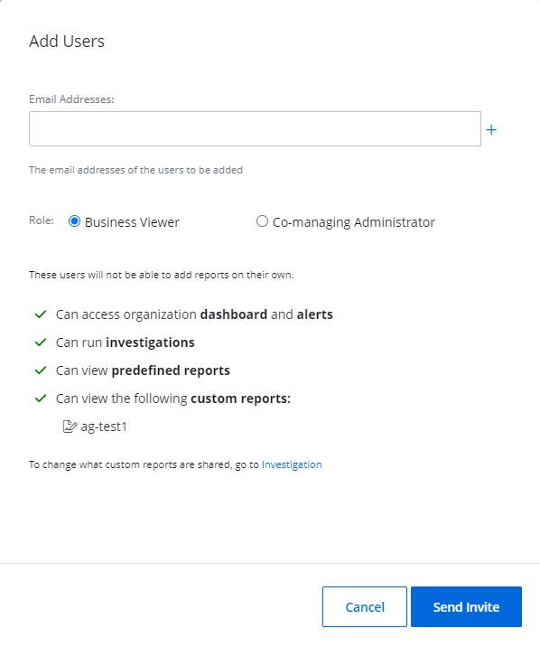
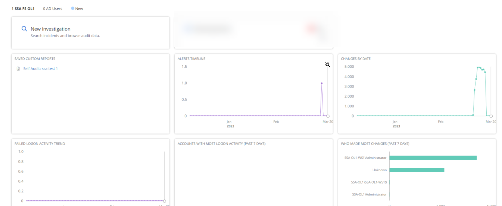

# Add Users

After you added the organization to your system, you may want to add users as part of your organization, depending on the role you would like to provide them. The users in {{ MyVariables.ProductName_Overlord }} include:

- Administrator
- Editor
- Viewer

You can add users both in Managing Organization and in Managed Organization. See the [Manage Organizations](/Admin/Organizations/README.md)  topic for additional information. 

Image keys:

| Icon | Description |
| --- | --- |
|    | Bin Icon. Click the Bin  Icon to delete the user. |
|    | Edit icon. Click the Edit Icon to edit the user data. |

## Add Users to Managing Organization

The Users page allows a Managed Service Provider  to provide the client's manager with  access to review reports or other activities. In this case, the MSP shall assign the Viewer rights to the manager. 

Follow the instructions to add a user.

In the {{ MyVariables.Website }}, go to **Configuration** &gt; **Users** page, click **Add Users**. 

Specify email addresses of the user and roles:

- Administrator – full access rights within the tenant
- Editor –  modification access rights within the tenant
- Viewer – read-only access rights within the tenant

## Access Rights for Roles

| Role | Admin | Editor | Viewer |
| --- | --- | :---: | --- |
| My organizations - Home | + | + | + |
| Child tenant dashboard | + | + | + |
| Configuration page | + | + | - |
| Child tenant alerts overview drill-down | + | + | + |
| Child tenant investigation pane | + | + | + |
| С- Users | + | + | - |
| C - My Organization | + | - | - |
| Add organization | + | + | - |
| Add/Edit Tags | + | + | - |
| Request deletion for a child tenant | + | + | - |
| Check/Manage child organization settings | + | + | - |
| Add/Manage child-level users | + | + | - |
| Add/Manage MSP-level users | + | - | - |
| Resend Invite for already added users | + | + | - |
| Customize existing Alerts | + | + | - |
| Edit Alerts delivery settings | + | - | - |
| Activate/Deactivate alerts | + | + | - |
| Managing and assigning alert profiles for child tenants | + | + | - |
| Managing integrations | + | - | - |
| Requesting deletion for MSP-level tenants | + | - | - |
| Performing Search | + | + | + |
| Saving/Deleting a custom report/folder | + | + | - |
| Exporting report data | + | + | - |
| Managing/Configuring agent Self-update | + | - | - |
| Segregating access to child tenants for MSP users | + | - | - |

Select the Grant user temporary access check box if you need to allow access to specific user for certain period. 

For example, if you are a tenant administrator and you allowed a access to a member of your team who should edit 100 accounts before 08.03.2023, this member can manage these activities up to a certain period and the administrator does not need to suspend the rights manually.

Select one or more organization groups from the **Select organization group(s) for the user** drop-down menu. To specify multiple groups, select them one by one from the drop-down menu.

The user can only view and/or manage the organizations assigned to the group(s) you select here. @Snippet:1Secure/Organization:OrganizationGroup@

Click Add.

Follow the steps to review main options and statuses. 

To delete the user, select the **Bin icon**  for that user. 

To edit the user data, select the **Edit icon** for that user. 

In case the user received an invitation from your tenant and registered within a system, its status shall be Verified. 

If the user has not registered within a system, the status will be Pending Verification. The administrator may select Resend Invite to re-notify this user.

When logging in, the users see the Home screen, on which they can do the following actions:

- Add organization here by selecting **Add Organization**
- Find the organization by populating the  **Filtering the keyword** field
- Select the required filters from the **Alert**, **Health Status**, **Tag**, **Time Filter** drop-down lists. These filters will apply to available organizations.

## Add the Business Viewer Role

This option is not available for End Customer Organizations. 

Add a Business Viewer role using the Managed Organizations page. The Business viewer is the organization user, which can be added by the System Administrator  to access the reports and other data of the organization. 

 The Business viewer role:

- Can access organization dashboards and alerts
- Can run investigations
- Can view predefined reports
- Can view the following custom reports:

    - ag-test1

Business viewer cannot add reports on their own. When creating the report, tick the option **Share with business users**. This way, all the business users can view the shared reports. See the [Custom Reports](../SearchAndReports/CustomReports.md)  topic for additional information. 

As you add the business viewer, the created reports shall be automatically displayed.

Follow the steps to add the Business Viewer role.

On the Managed Organizations page, select your organization and select to the **Users** tile. 

Click **Add User**.

Verify that the **Business Viewer** radio button is selected. This is the default option.

Specify email addresses you want to add for the role.

 Click **Send Invite**. 

The Business viewer role  provides access to the Home screen, which displays the logged in organization.

When logging in, if the Business Viewer account is registered with multiple organizations, select the one you wish to access.

## Add the Co-Managing Administrator Role

Add a Co-Managing Administrator role using the Managed Organizations page. The Co-Managing Administrator extends the permissions available with the Business Viewer role, which can be added by the System Administrator  to access the reports and other data of the organization. 

 The Co-Managing Administrator role:

- Can configure sources and connectors
- Can add business viewers
- Can run investigations
- Can view predefined reports
- Can view custom reports

The Co-Managing Administrator role cannot add reports on their own. When creating the report, select the option **Share with business users**. This way, all the business users can view the shared reports. See the [Custom Reports](../SearchAndReports/CustomReports.md)  topic for additional information.

Follow the steps to add the Co-managing Administrator role.

On the Manage Organizations page, select your organization and click the **Users** tile. 

Click **Add User**.

Specify email addresses you want to add for the role.

Select the **Co-managing Administrator** radio button.

Click **Send Invite**. 

The Co-managing Administrator role  provides access to the Home screen, which displays the logged in organization.

## Delete a Managed Organization User

Follow the steps to delete a user from a managed organization.

User(s) can only be deleted from a managed organization by tenant administrators or co-managing administrators. @Snippet:1Secure/Organization:ManagedOrgNav@ @Snippet:1Secure/Organization:OrgSelectionNav@

Click the **Users** tab. The users for the organization are listed here.

Click the **Delete** icon for a user to delete it.

A dialog box is displayed, prompting you to confirm the deletion of the user.

Click **Yes**.

The user is deleted.