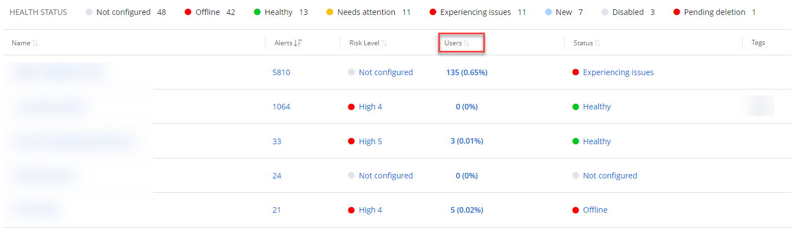

# Billable Accounts

{{ MyVariables.ProductName_Overlord }} provides an information on the billable accounts – the enabled Active Directory/{{ MyVariables.Azure_AD_app }} (formerly Azure AD) accounts for your organization. You can review these accounts (in numbers and percentage from total numbers of served users) in the Users column on the main dashboard of your Home page. 

To view the numbers of the column, your organization should add the Active Directory/{{ MyVariables.Azure_AD_app }} sources and connectors. 

You can review the Active Directory/{{ MyVariables.Azure_AD_app }} users on the following dashboards:

- Managing Organization

- Managed Organization

You can also review the Billable Users reports with the detailed information for each account. See the [Billable Users Report](../SearchAndReports/BillableUsers.md)  topic for additional information. 

## Calculation of the Numbers

{{ MyVariables.ProductName_Overlord }} calculates and dedupes the users that are synced across AD and {{ MyVariables.Azure_AD_app }}. 

The system calculates:

- a total number of   on-prem AD users
- a total number of {{ MyVariables.Azure_AD_app }} native users (not synced with on-prem)
- a total number of synced users from on-prem {{ MyVariables.Azure_AD_app }} (or hybrid users)

The number of synced users from on-prem is registered against the on-prem tenant reference. {{ MyVariables.ProductName_Overlord }} uses the highest number out  of on-prem users reported by the Agent and  the number of hybrid users reported by the {{ MyVariables.Azure_AD_app }} connector as the on-prem total. Then the {{ MyVariables.Azure_AD_app }} users, which are not synced with on-prem envinronment, are added. 

**Example:**

| Company has: | The numbers provided to {{ MyVariables.ProductName_Overlord }}: | The numbers given by {{ MyVariables.ProductName_Overlord }} in the app: |
| --- | --- | --- |
| **On-prem AD**: 200 users | **Agent**                          
                          On-prem: 200 | User Counts 
                          **On-prem**: Max (200, 150) = 200 |
| **{{ MyVariables.Azure_AD_app }}**: 250 users (150 users synced from on-prem + 100 Azure AD only users) | **{{ MyVariables.Azure_AD_app }}**                          
                          o	150 from on-prem domain 
                          o	100 Azure AD | **{{ MyVariables.Azure_AD_app }}**: 100 |
|  |  | **Total**: 300 |

The percentage is calculated as follows:

percentage = users calculated in the environment / users for which the license is purchased

## Omits From the Accounts

The accounts with the following attributes are not counted against a total number of Active Directory accounts  by default:

- \*\System\Policies\{\*}\*
- \*\Configuration\Deleted Objects\CRUpdate\*
- \*\Configuration\LostAndFoundConfig\*
- \*System\BCKUPKEY\\*
- \*System\IP Security\\*
- \*System\FileLinks\VolumeTable\\*
- \*\Deleted Objects\*
- \*\Configuration\Extended-Rights\ms-Exch-\*
- \*\Microsoft Exchange System Objects\SystemMailbox\*
- \*\HealthMailbox\*

You can also exclude service accounts from your billable accounts. To do this, add these accounts to an Azure Group or Active Directory Organizational Unit respectively and specify it in the source settings. See the [Add an Active Directory Source and Connectors](SourcesAndConnectors/EntraID.md)  topics for additional information.