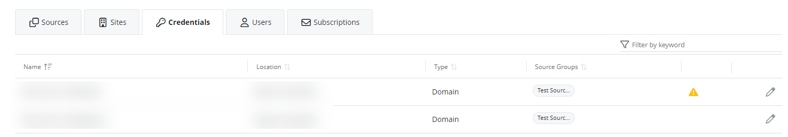

#  Manage Credentials 

In {{ MyVariables.ProductName_Overlord }}, you need to set up credentials while adding the sources for crawling your data. You can then review the credentials, edit, or delete them on the Configuration &gt; Managed Organizations &gt; Credentials tab, by selecting the organization.

This page allows to you review you the name of the source you created, its location (cloud or on-prem), and type. You can edit or delete the credential by selecting the credential and then click the **Edit** or **Delete** icon. 

| Icon | Description |
| --- | --- |
|    | Alert Icon. Click the Alert Icon to notify that the credentials have expired or been lost after reinstallation of the Netwrix Cloud Agent and must be entered again before they can be used. |

You can delete a credential if no sources are using those credentials.