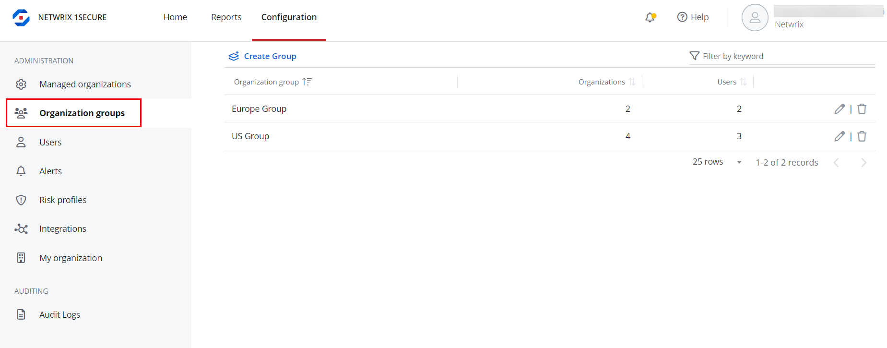
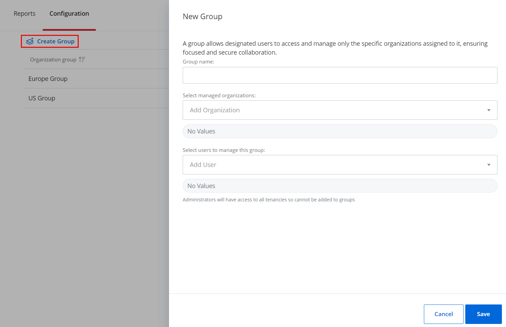
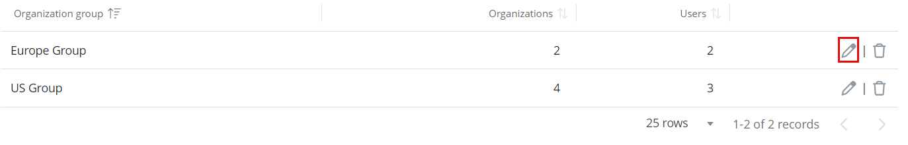

# Organization Groups

An organization group allows designated users to access and manage only the specific organizations assigned to it. Each group consists of assigned organizations and the users responsible for managing them. @Snippet:1Secure/Organization:OrganizationGroup@

## Add an Organization Group

Follow the steps to add an organization group. @Snippet:1Secure/Organization:Navigation@

Click **Create group**. The New Group pane is displayed.

Specify the following:

- Group name – Specify a name for the organization group
- Select managed organizations – Select an organization to assign it to the group. To assign multiple organizations, select them one by one from the drop-down menu. These organizations will then be managed under the group.
- Select users to manage this group – Select a user who is responsible for managing the organizations assigned to the group. To specify multiple users, select them one by one from the drop-down menu.

Click **Save**.

The organization group is added in the list. You can view the following for it:

- Organization group – The name of the organization group
- Organizations – The number of organizations assigned to the group
- Users – The number of users who are managing the organizations in the group

Filter Organization Groups

On the Organization groups page, enter a search string in the Search field on the top right of the page. Group names containing the string are displayed as you type.

## Modify an Organization Group

Follow the steps to modify an organization group. @Snippet:1Secure/Organization:Navigation@

Click the Edit icon for the organization group you want to modify. The Editing Group &lt;group name&gt; pane is displayed.

Modify the required information. For details, refer to Step 3 in the [Add an Organization Group](#Add))  section.

Click **Save**.

## Delete an Organization Group

Follow the steps to delete an organization group. @Snippet:1Secure/Organization:Navigation@ 

Click the **Delete** icon for an organization group to delete.

A dialog box is displayed, prompting you to confirm the deletion of the group.

Click **Yes**.

The organization group is deleted from the system.