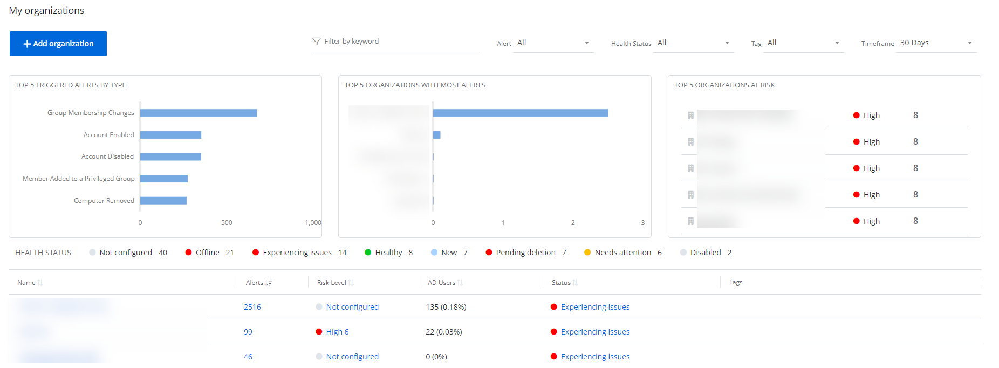
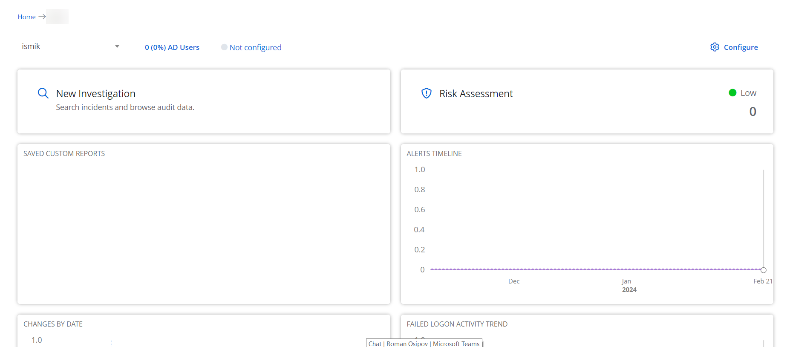

# Manage Organizations

{{ MyVariables.ProductName_Overlord }} operates as a service, providing data analysis and reporting capabilities for the organizations (tenants) or company departments/RO/BOs. Organization management pages are available to the authorized administrators of a company or Managed Service Provider on the Configuration page.

The topics in this section provide  information for: adding your organization, adding users, adding data source, and other configurations for the Managed Service Provider. 

After authorizing in a system, Managed Service Providers (MSP) need to configure their organization. The Organization is the name of the company you use to log in. See the [Log in Netwrix 1Secure](../LogIn.md)  topic for additional information.

In system, there are parent tenants and child tenants. *Parent tenant* or Managing Organization is the MSP you are authorizing with. The MSP or parent tenant may have lots of clients or *child tenants* (Managed Organization), which you can review and add on the Managed Organization page. 

Below you can see home pages of:

- Managing Organization

- Managed Organization

See the following topics for additional information:

- [Add Organizations](/Admin/Organizations/AddOrganizations.md) 
- [Add Users](/Admin/Organizations/AddingUsers.md) 
- [Sources and Connectors](SourcesAndConnectors/README.md) 
- [Manage Credentials](/Admin/Organizations/ManagingCredentials.md) 