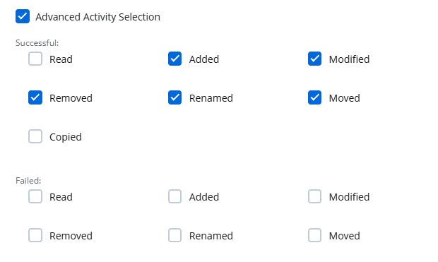

# Add a Source and Connectors for Computer

Follow the steps to add a Computer data source and connector(s) to your organization. @Snippet:1Secure/Organization:ManagedOrgNav@ 
@Snippet:1Secure/SourcesAndConnectors:OrgSelectionStep@ 
@Snippet:1Secure/SourcesAndConnectors:StepClickAdd@ 
@Snippet:1Secure/SourcesAndConnectors:SelectDataSource@ 
 pane")

Select **Computer** and click **Next**..png "Configure Source Details (Step 2 of 3) pane") @Snippet:1Secure/SourcesAndConnectors:SiteSelectStep@

- @Snippet:1Secure/SourcesAndConnectors:NewSiteBullet@
- @Snippet:1Secure/SourcesAndConnectors:ExisSiteBullet@

    - @Snippet:1Secure/SourcesAndConnectors:NewSiteBullet2@
    - If the agent has already been configured for the site, the system will proceed with the Computer source and connector settings when you click *Next*.

Click **Next**..png "Configure Source Details (Step 2 of 3) pane")

Select the **Manual** or **AD Container** option button.

- Manual – Select this option to crawl a single computer or all computers within a domain. Specify the following:

    - Endpoint – Specify the IP address, fully qualified domain name (FQDN), or NetBIOS name of the computer to crawl. If you specify a FQDN, all computers within that domain will be crawled.
    - Source Name – Specify a name for the data source
    - Computer source group – Displays the computer source groups that have already been added, while also providing the option to add a new source group. Grouping sources, such as computers, allows them to share a common configuration and makes it easier to manage related sources together. Select an existing source group or add a new one. To add a new source group, select **Add new computer source group** from the drop-down menu or click the **Add** icon, then specify a name for the source group in the Add new computer source group field.
- AD Container – Select this option to crawl the computers within an Active Directory container, then specify:

    - Domain Name – Specify the FQDN of the domain the container exists in.
    - Container Name – Specify the name of the container to crawl its computers.
    - Detection Interval – Specify the time interval (in hour(s) and minutes(s) after which the source group will automatically detect the computers for auditing.
    - @Snippet:1Secure/SourcesAndConnectors:SourceGroup@
- @Snippet:1Secure/SourcesAndConnectors:CrawlSource@
- @Snippet:1Secure/SourcesAndConnectors:Credentials@

    - Username – The name of a user account with the access rights to collect data from a computer or all computers in a domain. Provide the username in the Domain\UserAc<madcap:annotation madcap:createdate="2025-02-19T16:04:55.1401238+05:00" madcap:creator="HassaanKhan" madcap:initials="HA" madcap:comment="what are the permissins the account should have?" madcap:editor="HassaanKhan" madcap:editdate="2025-02-19T16:04:56.4441202+05:00">cou</madcap:annotation>nt format.
    - Password – The password of the user account
    - @Snippet:1Secure/SourcesAndConnectors:DisplayName@

 Click **Next**. pane")

The Choose new connector pane (Step 3 of 3) lists one connector for computer. Specify the following:

- File Server Activity – Toggle the **File Server Activity** switch to ON to collect and monitor data for this connector. With this, you can generate activity reports on File Server data. See the [File Server](../../SearchAndReports/Activity.md#File)  topic for additional information.
- @Snippet:1Secure/SourcesAndConnectors:TrafficNetCompression@ 
 @Snippet:1Secure/SourcesAndConnectors:SameDomainProducts@
- @Snippet:1Secure/SourcesAndConnectors:AdjustAutoAudit@
- Monitor User Hidden Shares – Select this checkbox to monitor the user hidden shares on the computer.

    The administrative hidden shares such as admin$ will not be monitored.
- Advanced Activity Selection – Select  this checkbox to choose the successful and failed actions to audit on the computer.

Click **Finish**.

The Computer data source and connector have been configured.