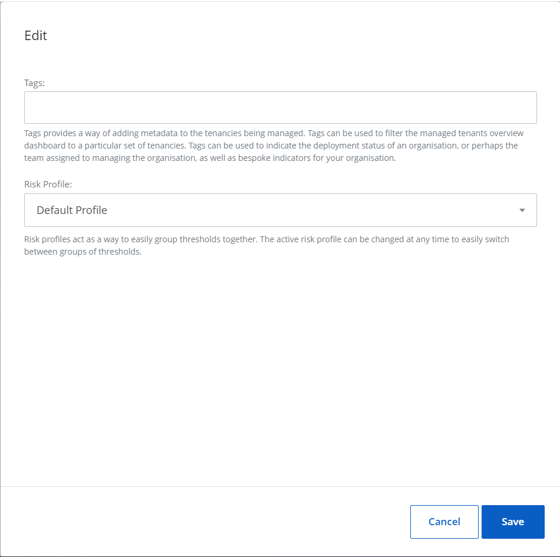
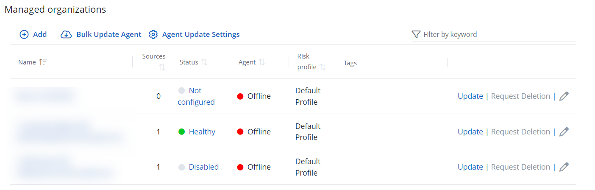
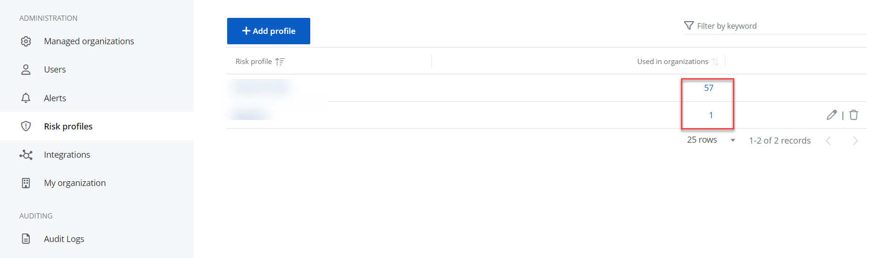

# Risk Profiles

When a Managed Service Provider creates an organization or edits its profile, it can add a Risk Profile to track potential risks within the organization.

## Add a Risk Profile

Follow the steps to add a Risk Profile.

On the **Configuration** &gt; **Risk Profiles** page, click **Add profile**.

Enter a name for the profile and select **Save**. 

The Risk Profile is added.

## Edit or Delete a Risk Profile

Follow the steps to edit a Risk Profile.

Click the **Edit** icon next to the Risk Profile.

Make the desired changes to the Risk Profile.

Click **Save** to save your changes. 

To delete the profile, select Bin icon next to the Risk Profile you wish to delete and click **Delete**. 

## Add a Risk Profile to Your Organization

After adding a Risk Profile, you can add it to your organization's profile. You can do this when adding your organization or editing it.

Follow the steps to add a  Risk Profile to your organization.

Add your organization or edit the existing organization.

See the [Add organizations](../Organizations/AddOrganizations.md)  topic for additional information.

In the Risk Profile drop-down list, select the Risk Profile and click **Save**.

The Risk Profile is now added to your organization.

 You can view the Risk Profile on the **Managed organizations** page on your organization's line.

You can also view  which organizations your Risk Profile has been added to in the **Risk profiles** section.