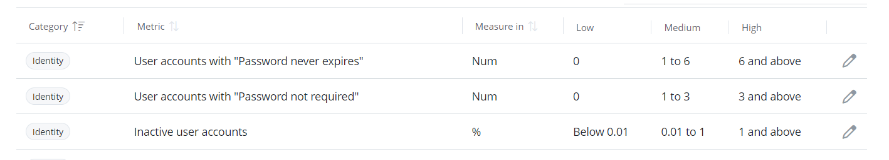
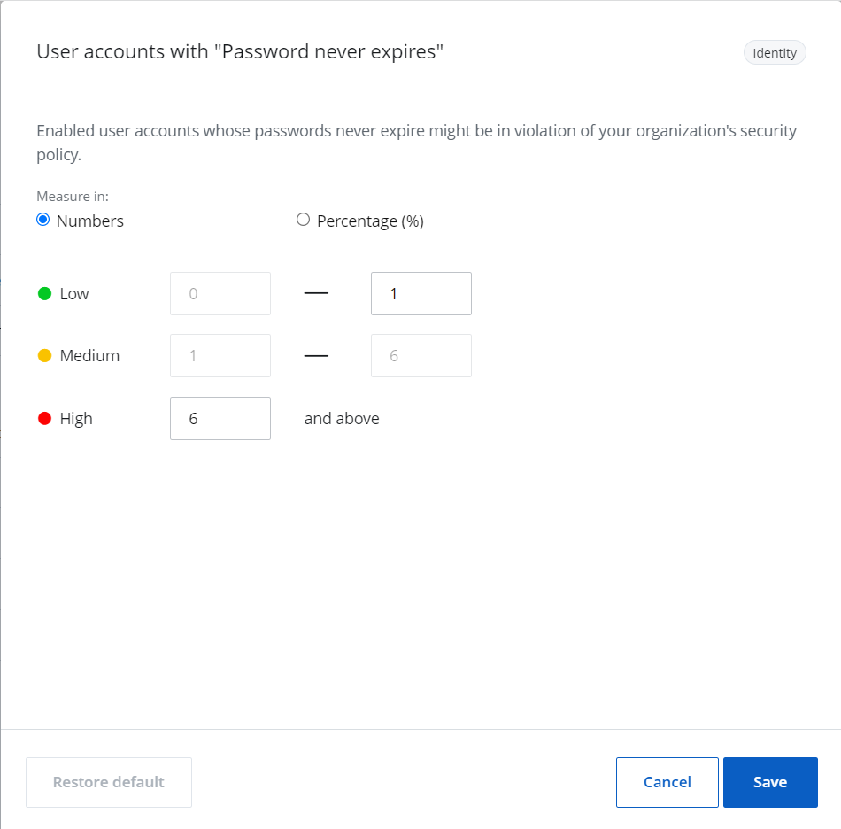
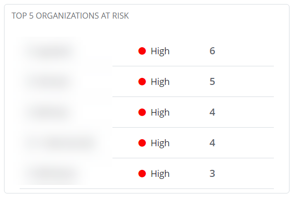

# Configure Risk Profile

{{ MyVariables.ProductName_Overlord }} provides a preset selection of risks such as Empty security groups, Disabled computer accounts, and others. You can review all of the risks and set the thresholds for each risk. 

Follow the steps to configure a risk profile.

On the **Risk profiles** card, select your profile.

Select the **Edit** icon for the risk.

Specify the low, medium, or high thresholds for each risks. You can choose either numbers or percentages for your settings.

For example, if you set "6 and above" in "High" field, the risk alert with this value may be displayed on the Home page in the "Top 5 Organizations at risk" dashboard, specifying the risk is high.

Select **Save**.

The parameters for the risks are now configured. You are set up!