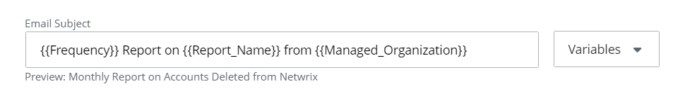

# Risk Assessment Dashboard

Risk Assessment is a tool for MSPs and their end clients to diagnose the security posture of a client's infrastructure. Lowering the risks on a regular basis is a way for MSPs to ensure their client environment stays aligned to the best security practices.

As an MSP, I want to know:

- What are the security risks of this organization? Are they low, medium, or high?
- How do they compare to the previous week/month/quarter? Is it better or worse?
- How my client's security posture aligns with security frameworks like NIST?

The Risk Assessment Dashboard gives MSPs an answer to these questions so that they can achieve the described goals.

You can access the dashboard from:

- The Home screen, by clicking the organization in the "Top 5 Organizations at risk" dashboard (for MSPs).
- The Home screen, by searching your organization in the list of organizations (for MSPs).
- The Home screen, by clicking the Risk Assessment dashboard (for organizations).

| Icon | Description |
| --- | --- |
|    | Sprocket Icon. Click the Sprocket Icon  to set up the risk profile for your organization. |

The Risk Assessment Dashboard provides an overall view of the risks for your organization.

Select the following drop down lists. 

- **Arrow for choosing organization** – Select the desired organization from the drop-down list, located at the top left of the dashboard (if you are a Managing Organization or an MSP)
- **Trend Since** – Review the risks since the required period (Last month, Last week, Last 3 months). The trend **Since last month** is enabled by default
- **Risk Profile Preview** – Select a risk profile for your organization from the drop-down list

You can also click the Sprocket icon to set up the risk profile for your organization. See the [Risk Profiles](/Admin/RiskProfiles/AddProfile.md)  topic for additional information.

View the following tabs of the dashboard. 

- Tabs – Click each of the tabs, like "**High**", "**Medium**", or "**Low**", to view  what risks are on high, medium, or low state
- Since last month (upward) – Displays the number or risks added since last month, if there has been an increase. This widget also displays the following information:

    - \* risk(s) rising – Risks that became high within this month (last 3 months)
    - \* more medium – Risks that were elevated from "Medium" state to "High" state according to the set threshold
    - \* high risk(s) more – Risks that were elevated from "Low" state to "High" state according to the set threshold
- Since last month (downward) – Displays the number or risks decreased since last month, if there has been a decrease. This widget also displays the following information:

    - \* risk(s) falling – Risks that became low within this month (last 3 months)
    - \* less medium – Risks that were downgraded from "Medium" state to "Low" state according to the set threshold
    - \* less risk(s) high – Risks that were downgraded from "High" state to "Low" state according to the set threshold

You can filter the risks by selecting the required drop-down risks below the tabs:

- **All Categories** – Select the risks of the required category (Identity, Infrastructure, Data, or All Categories)
- **All Severities** – Select the risks of the required state (High, Medium, or Low). You can also click the desired tab  (High, Medium, Low, or All Severities)
- **All trends** – Select the risks of the required trend (Upwards, Downwards, or All trends)
- **All types**  – Select the type of the risk:

    - Enumerated – Shows the risks which have counts against a whole collection, e.g. computer(s). The system displays both risks with no changes or with changes in numbers. See the table below, whether the risk is enumerated
    - Binary – Shows the risks  which are true or false against a whole tenancy (boolean risks). The system displays detected risks (true) as either Medium or High risk depending on configuration, undetected risks (false) are displayed as Low.  See the table below, whether the risk is binary

You can also search the risks by typing a keyword in the **Filter by keyword** field. 

The following table provides a list of risks and descriptions.

| Risk Name | Description |
| --- | --- |
| User accounts with "Password never expires" (Enumerated) | Enabled user accounts whose passwords never expire might be in violation of your organization's security policy. |
| User accounts with "Password not required" (Enumerated) | Accounts that can be used to log on without a password are a high risk and require immediate attention. |
| Disabled computer accounts (Enumerated) | Disabled computers often lack current patches and antivirus software, making them easy targets for cyberattacks if they are re-enabled. Periodically identifying and deleting these accounts will reduce this risk. |
| Inactive user accounts (Enumerated) | Inactive user accounts can be taken over and misused, so you should periodically identify and disable them, and then remove them. |
| Inactive computer accounts (Enumerated) | Inactive computer accounts can be misused, so you should periodically identify and disable them, and then remove them. |
| User accounts with administrative permissions (Enumerated) | Minimizing the number of users with administrative privileges reduces security risks and is required by many compliance mandates. |
| Administrative groups (Enumerated) | Minimizing the number of administrative groups helps you understand and control the assignment of powerful permissions, as required for security and compliance. |
| Empty security groups (Enumerated) | Empty security groups with administrative privileges are a potential back door for attackers. Regularly identify and delete empty groups. |
| Stale Guest Accounts (Enumerated) | Any guest users that have not logged in for "X" days. By default, the accounts that have not logged in for 35 days are shown. You can filter this data. |
| User Accounts Created via Email Verified Self-Service Creation 
                          (Enumerated) | User accounts created with self-service account creation. Self-service account creation when not strictly verified, can allow unauthorized individuals to gain access to an organization's systems. This can lead to unauthorized data access, leakage of sensitive information, and the establishment of footholds for further attacks within the network. |
| User accounts with "No MFA Configured" (Enumerated) | User accounts which MFA is not configured with the admins of the organizations in {{ MyVariables.Azure_AD app }}. Without MFA, compromised credentials can lead directly to unauthorized entry, bypassing what is now considered a basic security standard. In the absence of MFA, even a strong password policy may not be sufficient to protect against phishing attacks and credential stuffing, which can lead to data breaches and system compromises. |
| Improper Number of Global Administrators 
                          (Binary) | Maintain strict control over the number of global administrators to minimize the risk of internal and external threats. Elevated privileges associated with such roles can lead to significant breaches if misused or compromised, disrupting business operations and potentially leading to substantial data loss or compliance violations. |
| Self-Serve Password Reset is Not Enabled 
                          (Binary) | Office 365's Self-Serve Password Reset feature enables users to reset their own password. It is recommended to allow users to reset their own passwords for the purpose of recovering their account in the event of accidental lockout or a security incident. |
| Unified Audit Log Search is Not Enabled 
                          (Binary) | Unified Audit Log Search allows for the centralized ingestion and searching of audit logs generated by Office 365 and can be a vital source of data for the investigation and detection of security incidents. It is recommended to enable unified audit log searching. |
| Conditional Access Policies 
                          (Binary) | Insufficient Conditional Access and Security Defaults Configuration: The absence of Conditional Access policies coupled with disabled Microsoft Security Defaults creates a significant security vulnerability. This condition exposes the tenant to a variety of attacks due to inadequate protective measures. It is required for the organization to either enable Microsoft Security Defaults for common security features or establish fine-grained Conditional Access policies tailored to the organization’s specific security needs. Ensuring these security configurations are active and correctly set up is crucial to safeguard the tenant environment and user accounts from potential cyber threats. |
| Conditional Access Policy Disables Admin Token Persistence 
                          (Binary) | Looks for Conditional Access policies that disable token persistence for users with admin roles and have a sign-in frequency that is less than or equal to nine hours. When an admin login has their token cached on the client, they are vulnerable for a Primary Refresh Token related attack. |
| Dangerous Default Permissions 
                          (Binary) | By default, Azure tenants allow all users to access the {{ MyVariables.Azure_AD app }} blade, to read all other users’ accounts, create groups, and invite guests. These default settings extend to guest accounts as well, allowing guests to perform these same actions. Other default configurations allow for Self-Service creation of accounts from accepted mail domains. 
                          Amend dangerous default permissions, mitigating the risk of unauthorized data access and ensuring that only the necessary personnel have the appropriate level of access to sensitive systems and information. |
| Expired Domain Registrations Found 
                          (Binary) | Expired domains can be used for any attack vector that exploits an organization’s identity, such as account takeovers or phishing campaigns. Monitoring domain registration for the organization can help detect and alert on attempts to exploit this attack path. |
| MS Graph Powershell Service Principal Assignment Not Enforced 
                          (Binary) | Checks if the assignment for MsGraph Powershell is required. By default, Azure tenants allow all users to access Microsoft Graph PowerShell Module. This allows any authenticated user or guest the ability to abuse Dangerous Default Permissions, as well as enumerate the entire tenant. |
| Third-Party Applications Allowed 
                          (Binary) | Third-party integrated applications are allowed to run in the organization's Office 365 environment if you authorize them to do so. This configuration is considered insecure because a user may grant permissions to a malicious application without fully understanding the security implications. A user who installs a malicious third-party application is in effect compromised. Additionally, there are documented cases of a malicious actor gaining access to sensitive information by enticing a user to allow a third-party integrated application to run within their O365 Tenant. |

## View Details of the Risks

Risk Assessment Dashboard provides the comprehensive information on each risk of your organization on one page. Depending on the filters you selected, the dashboard shall display the corresponding risks. Click the required risk on the left pane and the details will be displayed on the right pane. 

Follow the steps to view the details of the dashboard.

Click the required risk on the left pane.

On the right pane, review the details of that risk. This includes the risk category, severity (high, medium, or low), changes (previous and current) - if it is enumerated, and trend. Below you can see the risk history schedule, the description of the risk identity, and the applicable regulations for the risk. 

You can also review the measure of the risk - "%"(percentage) or "k"(thousands).

Review the risk history lines:

- Blue line – Specifies the risk value itself
- Red line – Specifies the bottom of the high risk threshold
- Yellow line – Specifies the bottom of the medium risk threshold

Optionally, click **Open report** to dive into the report details of the record. See the [State In Time Risks Reports](../SearchAndReports/StateInTime.md)  topic for additional information. 

## Export a Report to Email

Follow the steps to export a report to your email. 

Click **Export** in the upper right corner of the page.

In the Exporting Risk Assessment window, specify the following details:

- File name – Name of your report
- Timeframe – Desired period for report provision (Last week, Last month, Last 3 months, Last year)

Select the **Include Low Risks** check box to include low risks in your report, if necessary.

Click **Export**. 

You shall receive the report in PPTX to your login email. 

## Add a Subscription

You can also subscribe to the Risk Assessment Dashboard report of the managed organization. A subscription is a regularly-scheduled report, which you can send to required emails automatically. See the [Subscriptions](../SearchAndReports/Subscriptions.md)  topic for additional information. 

Follow the steps to add a subscription for the Risk Assessment Dashboard.

Click **Subscribe** in the upper right corner of the Risk Assessment Dashboard. The Subscription to "*name of the report*" window displays.

Enter a start date, time, and a time zone for starting the subscription. 

Specify frequency for sending the reports from the drop-down list (daily, weekly, or monthly). 

You can view the result for your specification at the footer of the window. 

In the **Attached file** field, specify the name of the file you shall receive. 

From the variables dropdown, select the variable from the drop-down list to be displayed in the email subject (Report Name, Export Date, Frequency, Managing Organization, Managed Organization).

Click the **Include Low Risks** check box to include low risks in the report. 

Click the **Send reports by email** check box to specify the  settings for the email delivery.

In the **Email Settings** section, specify the following fields: 

- Recipients – Specify the required email addresses. You can enter multiple addresses separated by a comma.
- Variables – Select the variable from the drop-down list to be displayed in the email subject (Report Name, Export Date, Managing Organization, Managed Organization). You shall see the name of your report in the preview.

    End Customer Organization has the Organization Name option instead of Managed Organization and Managing Organization options.
- Message – Enter the information to be included in the email message

Click the **Upload reports to a designated folder in SharePoint Online** check box to specify the settings for SharePoint Online delivery.

If you see the message "Integration required" you need firstly set up your integration for SharePoint Online. See the [SharePoint Online](../../Integration/SharePointOnline.md)  topic  for additional information. 

Specify the following fields:

- SharePoint Online Site URL – The URL of the SharePoint Site (e.g. https://site.Sharepoint.com/sites/sitename)
- SharePoint Online Folder Path – The folder path in SharePoint, relative to the site URL (e.g. /Shared Documents/FolderName)

    For MSP organizations, reports will always be saved to the location in a sub-folder named after the child organization.

Click **Save**. 

The subscription is created. You can find it on your **Configure** &gt; **Subscriptions** tab.