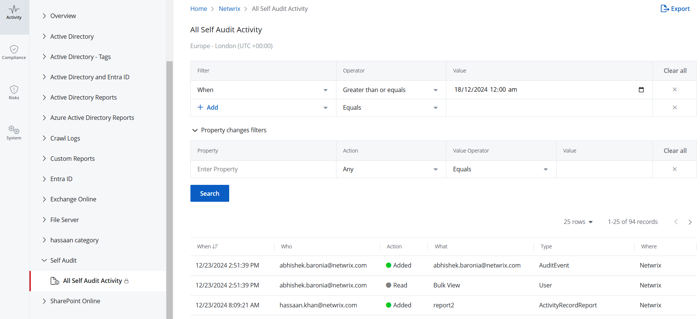

# Generate a Self-Audit Report

Built-in {{ MyVariables.ProductName_Overlord }} self-audit allows you to track changes to the product configuration, including connectors, data sources, audit scope and details about it (before-after values).  This ensures that the monitoring scope covers all major aspects of your organization.

 The self-audit report lists all changes made to an organization since its creation.

Only a Managed Service Provider can generate this report. 

 Follow the steps to generate the self-audit report.

Navigate to **Configuration** &gt; **Audit Logs**. The Activity Reports page is displayed, with All Self Audit Activity selected in the left pane and the corresponding report displayed on the right.

The All Self Audit Activity report is generated for the <madcap:annotation madcap:createdate="2025-01-02T16:37:59.5715317+05:00" madcap:creator="AyeshaAzeem" madcap:initials="AY" madcap:comment="Is this organization available to all clients? Is it created by default?" madcap:editor="AyeshaAzeem" madcap:editdate="2025-01-02T16:40:47.8767092+05:00">Netwrix (Parent)</madcap:annotation> organization by default. However, you can select a different organization from the drop-down menu at the top of the left pane to view its All Self Audit Activity report.

In  this report, a default filter is applied with the following settings:

- Filter = When
- Operator = Greater than or equals
- Value = This field displays the date one week prior to the current date. For example, if today is 01/07/2025, the Value field will display 01/01/2025 12:00 am.

You can apply more filters if required. Select a filter, operator, and value, then click **Search**. The report displays data based on the applied filters.  
Y