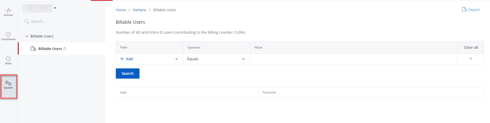

# Billable Users Report

A Billable Users report  provides information on the billable accounts – the enabled Active Directory/{{ MyVariables.Azure_AD_app }} (formerly Azure AD) accounts for your organization. See the [Billable Accounts](../Organizations/BillableAccounts.md)  topic for additional information. 

| Icon | Description |
| --- | --- |
|    | Lock Icon. It shows that the business users cannot view the report. See the [Add Users](../Organizations/AddingUsers.md)  topic for additional information on the business users. |

## Review a Report

Follow the steps to review a billable users report. 

On the Home page, click the **Users** of your organization. The **System** &gt; **Billable Users** page opens. By default, it populates the data with the Users of your organization.

- Dashboard for Managing Organization

- Dashboard for Managed Organization

You can also access the report by navigating to the **Reports** &gt; **System** page.

If necessary, you can filter the provided data. Select a filter, operator, and value from  the Filter, Operator, and Value drop-down menus respectively. 

You must specify three columns: Filter, Operator, and Value. You may also select more than one filter. To review the Operator filter options, see the [Filter Operators](/Admin/SearchAndReports/FilterOperators.md) topic for additional information. 

Click **Search**. 

You can also export a report to your email by clicking **Export**  in the upper right corner of the page. You shall receive a report in XLSX to your login email. 

## Filter Descriptions

This table provides a list of filters and descriptions.

| Filter | Description |
| --- | --- |
| Account | Limits your search to a specific account. Account is an instance of a user, specific to a source.  
                          For example:  
                          User = John.Smith 
                          Account = AD User: John.Smith / Azure User: John.Smith |
| User | Limits your search to a specific user. |
| Source Type | Specify the source type of the user: <ul>
                             <li>
                                 
AD User

                             </li>
                             <li>
                                 
Azure User

                             </li>
                             <li>
                                 
Windows Local User

                             </li>
                         </ul> |