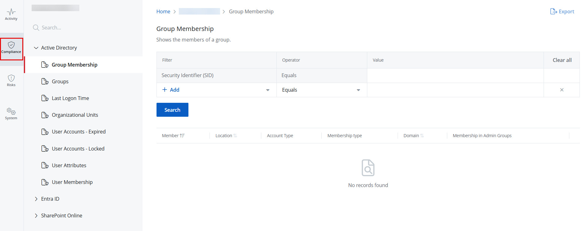

# Compliance Reports

Compliance reports help clients and Managed Service Providers gather information about their {{ MyVariables.Azure_AD_app }}, Active Directory, and SharePoint Online configuration state at a specific point in time. This enables them to prove compliance with many regulations to auditors.  Compliance reports provide information on user attributes, expired or locked user accounts, group memberships, and so on. 

## Review a Report

Follow the steps to review a Compliance report. @Snippet:1Secure/Reports:ActivityReportNav@ @Snippet:1Secure/Reports:ReportNavStep2@

Click the **Compliance** tab to access the compliance reports. This opens the Compliance page with the Group Membership report selected by default in the left pane. @Snippet:1Secure/Reports:ReportNavStep3@ Categories are:

- Active Directory
- Entra ID
- SharePoint Online @Snippet:1Secure/Reports:ReportNavStep4@

A list of the available Compliance reports is given below.

**Active Directory**

| Report Name | Description |
| --- | --- |
| Group Membership | Lists the members of a group. For each member, it provides details, including the name, path, account type, membership type, domain, and admin group membership. |
| Groups | Lists all groups within Active Directory. For each group, it provides details, including the name, path, group scope, group type, and direct member count. |
| Last Logon Time | Lists user and computer accounts with the path, status (enabled, disabled), account type, and last login time for each. |
| Organizational Units | Lists the organizational units and their paths. |
| User Accounts - Expired | Lists expired user accounts, with the path, logon name, and expiration date for each account. |
| User Accounts - Locked | Lists locked user accounts, with the path, logon name, and lock date for each account. |
| User Attributes | @Snippet:1Secure/Reports:UserAttributes@ |
| User Membership | Lists the groups the user is a member of, with the permissions granted to the groups. |

<madcap:variable name="MyVariables.Azure AD app" style="font-weight: bold;"></madcap:variable>

| Report Name | Description |
| --- | --- |
| Role Members | Lists {{ MyVariables.Azure_AD_app }} accounts (members or guests) assigned to a given role in your organization. Use this report to identify unauthorized role assignments or changes. |
| Roles | Lists the {{ MyVariables.Azure_AD_app }} roles in your organization and the number of accounts (members or guests) assigned to each role. |
| User Attributes | @Snippet:1Secure/Reports:UserAttributes@ |

SharePoint Online

| Name | Description |
| --- | --- |
| Broken Permissions Inheritance | Lists objects with permissions that differ from their parent, such as a folder with permissions different from its parent site. |
| Direct Object Permissions | Lists all identities (users or groups) that have assigned permissions to specific objects, such as documents, lists, or sites. Use this report to review which users or groups have access to data objects. |
| Direct User Permissions | Lists user accounts with direct permissions to specific objects. Use this report to see which users have permissions to what data. |
| High Risk Permissions | Lists the permissions and permission levels of high-risk trustees, such as Everyone, Authenticated Users, and Everyone except external users. |
| Permissions Overview by Resource | Provides a summary of assigned permissions in your organization, including the count of direct user permissions, stale permissions, broken permission inheritance, and high-risk permissions for each object. Click any permissions value to navigate to the specific permissions report for the selected resource. For example, clicking a High Risk Permissions value will take you to the High Risk Permissions report. |

Sort a Report @Snippet:1Secure/Reports:SortReport@ @Snippet:1Secure/Reports:ReportSearch@
        
## Filter Descriptions

This table provides a list of filters and descriptions.

| Filter | Description |
| --- | --- |
| Group Type | Filters the report based on any of the following group types: <ul>
                             <li>
                                 
Security

                             </li>
                             <li>
                                 
Distribution

                             </li>
                         </ul>
                          To apply this filter, select **Group Type** from the **Filter** drop-down menu and choose an option from the **Value** drop-down menu. |
| Group Name | Filters the report based on the name of a  group. 
                          To apply this filter, select **Group Name** from the **Filter** drop-down menu and specify a group name in the **Value** field. |
| Member Type | Filters the report based on any of the following member types: <ul>
                             <li>
                                 
User

                             </li>
                             <li>
                                 
Computer

                             </li>
                             <li>
                                 
Group

                             </li>
                         </ul>
                          To apply this filter, select **Member Type** from the **Filter** drop-down menu and choose an option from the **Value** drop-down menu. |
| Membership  
                          Type | Filters the report based on any of the following membership types: <ul>
                             <li>
                                 
Direct

                             </li>
                             <li>
                                 
Nested

                             </li>
                         </ul>
                          To apply this filter, select **Membership Type** from the **Filter** drop-down menu and choose an option from the **Value** drop-down menu. |
| Name | Filters the report based on the name of a user or computer account. 
                          To apply this filter, select **Name** from the **Filter** drop-down menu and specify a user or computer name in the **Value** field. |
| Path | This is a filter in the report, Groups. 
                          It filters the report based on the path of an object, which is a member of the group. The object can be a computer, user, or group. For example, "Account operator" is a group and its path is "BUILTIN/Account Operators", which is how you can find it in Active Directory Users and Computers (ADUC). 
                          To apply this filter, select **Path** from the **Filter** drop-down menu and specify a path in the **Value** field. |
| Security Identifier (SID) | Filters the report based on a Security Identifier (SID). The Security Identifier is a unique ID number that a computer or domain controller uses to identify you. 
                          To apply this filter, select **Security Identifier (SID)** from the **Filter** drop-down menu and specify a SID in the **Value** field. 
                          This filter is shown by default in the Group Membership report. |
| Status | Filters the report based on any of the following user account statuses: <ul>
                             <li>
                                 
Enabled

                             </li>
                             <li>
                                 
Disabled

                             </li>
                         </ul>
                          To apply this filter, select **Status** from the **Filter** drop-down menu and choose a status from the **Value** drop-down menu. |
| Inactive days | Filters the report based on an account's inactive days. 
                          To apply this filter, select **Inactive Days** from the **Filter** drop-down menu and specify the number of inactive days in the **Value** field. |
| AD and {{ MyVariables.Azure_AD_app }} User Attributes filters | Depending on the following filters, review the specific information on the user accounts that violate company policies or applicable compliance standards: <ul>
                             <li>
                                 
Account Cannot be Delegated 

                             </li>
                             <li>
                                 
Cannot Change Password

                             </li>
                             <li>
                                 
Change Password on next sign in

                             </li>
                             <li>
                                 
City

                             </li>
                             <li>
                                 
Country

                             </li>
                             <li>
                                 
Creation Date

                             </li>
                             <li>
                                 
Department

                             </li>
                             <li>
                                 
Description 

                             </li>
                             <li>
                                 
Email Address

                             </li>
                             <li>
                                 
Expiration Date

                             </li>
                             <li>
                                 
First Name

                             </li>
                             <li>
                                 
Is Locked

                             </li>
                             <li>
                                 
Job Title

                             </li>
                             <li>
                                 
Last Login

                             </li>
                             <li>
                                 
Last Modified

                             </li>
                             <li>
                                 
Last Name

                             </li>
                             <li>
                                 
Password Expiry

                             </li>
                             <li>
                                 
Password Last Changed

                             </li>
                             <li>
                                 
Path

                             </li>
                             <li>
                                 
Post Code

                             </li>
                             <li>
                                 
Primary Contact Number

                             </li>
                             <li>
                                 
SAM Account Name

                             </li>
                             <li>
                                 
State or Province

                             </li>
                             <li>
                                 
Status

                             </li>
                             <li>
                                 
Street Address

                             </li>
                             <li>
                                 
UPN (User Principal Name)

                             </li>
                         </ul> |
| Domain | Filters the report based on the  domain. 
                          To apply this filter, select **Domain** from the **Filter** drop-down menu and specify the name of a <madcap:annotation madcap:createdate="2024-10-03T13:55:51.9909860+05:00" madcap:creator="AyeshaAzeem" madcap:initials="AY" madcap:comment="What should be the format for providing the domain name?" madcap:editor="AyeshaAzeem" madcap:editdate="2024-10-03T13:56:10.8572348+05:00">domain </madcap:annotation>in the **Value** field. |
| Group Scope | Filters the report based on any of the following group scopes: <ul>
                             <li>
                                 
Universal

                             </li>
                             <li>
                                 
Global

                             </li>
                             <li>
                                 
Domain Local

                             </li>
                         </ul>
                          To apply this filter, select **Group Scope** from the **Filter** drop-down menu and choose an option from the **Value** drop-down menu. |
| Group Location | Filters the report based on the specific location of a group in the directory. 
                          To apply this filter, select **Group Location** from the **Filter** drop-down menu and specify a <madcap:annotation madcap:createdate="2024-10-03T14:00:40.2403933+05:00" madcap:creator="AyeshaAzeem" madcap:initials="AY" madcap:comment="What should be the format for specying a location?\r\n\r\nWill this filter limit the report to all groups at the provided location?" madcap:editor="AyeshaAzeem" madcap:editdate="2024-10-11T15:37:30.9837761+05:00">location </madcap:annotation>in the **Value** field. |
| Group Type | Filters the report based on any of the following group types: <ul>
                             <li>
                                 
Security

                             </li>
                             <li>
                                 
Distribution

                             </li>
                         </ul>
                          To apply this filter, select **Group Type** from the **Filter** drop-down menu and choose an option from the **Value** drop-down menu. |
| Department | Filters the report based on a department in your organization. 
                          To apply this filter, select **Department** from the **Filter** drop-down menu and specify the name of a department in the **Value** field. |
| Job Role | Filters the report based on a job role in your organization. 
                          To apply this filter, select **Job Role** from the **Filter** drop-down menu and specify a role in the **Value** field. |
| User Origin | Filters the report based on any of the following platforms where the user was initially created: <ul>
                             <li>
                                 
Hybrid AD

                             </li>
                             <li>
                                 
{{ MyVariables.Azure_AD_app }}
                                 

                             </li>
                         </ul>
                          To apply this filter, select **User Origin** from the **Filter** drop-down menu and choose a value from the **Value** drop-down menu. |
| User Type | Filters the report based on any of the following user types in Microsoft 365: <ul>
                             <li>
                                 
Member

                             </li>
                             <li>
                                 
Guest

                             </li>
                         </ul>
                          To apply this filter, select **User Type** from the **Filter** drop-down menu and choose a value from the **Value** drop-down menu. |
| Member Count | This filter appears in the Roles report and it filters the roles based on how many users are in it. You have to provide a number as a filter criterion  and the report will display the roles  that have the specified number of users. 
                          To apply this filter, select **Member Count** from the **Filter** drop-down menu and specify a number in the **Value** field. |
| Role | This filter appears in the Roles report and it filters the list of roles in the report according to a name. For example. adding the filter "Role Contains 'Administrator'" will return a list of roles like Global Administrator, Exchange Administrator, etc. It will not return roles  that do not contain the word. 
                          To apply this filter, select **Role** from the **Filter** drop-down menu and specify the full or partial name of a role in the **Value** field. |
| Enabled | Filters the report based on any of the following account statuses:  <ul>
                             <li>
                                 
Enabled

                             </li>
                             <li>
                                 
Disabled

                             </li>
                         </ul>
                          To apply this filter, select **Enabled** from the **Filter** drop-down menu and choose an option from the **Value** drop-down menu. |
| Is Built-In | Filters the report based on predefined roles in your organization. 
                          To apply this filter, select **Is Built-In** from the **Filter** drop-down menu and choose either **Yes** or **No** from the **Value** drop-down menu. |
| Is Privileged | Filters the report based on privileged roles in your organization. 
                          To apply this filter, select **Is Privileged** from the **Filter** drop-down menu and choose either **Yes** or **No** from the **Value** drop-down menu. |
| Resource Name | Filters the report based on the name of an  object, such as *Document*. 
                          To apply this filter, select **Resource Name** from the **Filter** drop-down menu and specify an object name in the **Value** field. |
| Object URL | Filters the report based on the URL of an object. For example, *SharePointHomeOrgLinks* is an object and its URL is *https://lbkt.sharepoint.com/Lists/SharePointHomeOrgLinks* 
                          To apply this filter, select **Object URL** from the **Filter** drop-down menu and specify an Object URL in the **Value** field. |
| Object Type | Filters the report based on an object type. For example, *Documents* is an object and its type is *SharePoint Online Document Library*. 
                          To apply this filter, select **Object Type** from the **Filter** drop-down menu and choose an option from the **Value** drop-down menu. |
| Accounts | Filters the report based on an account (user or group) with permissions to data objects, such as *Site Collection Administrators*. 
                          To apply this filter, select **Account** from the **Filter** drop-down menu and specify an account name in the **Value** field. |
| Account Type | Filters the report based on an account type, such as *SharePoint Online Group*. The report will display accounts belonging to the specified type with permissions to data objects. 
                          To apply this filter, select **Account Type** from the **Filter** drop-down menu and choose an option from the **Value** drop-down menu. |
| Permissions | Filters the report based on the permission assigned to an account, such as Add Items, Edit Items, Delete Items, etc. 
                          To apply this filter, select **Permissions** from the **Filter** drop-down menu and choose an option from the **Value** drop-down menu. |
| Last Logon | Filters the report based on an account's last logon date and time. 
                          To apply this filter, select **Last Logon** from the **Filter** drop-down menu and choose a date and time from the **Value** drop-down menu. |