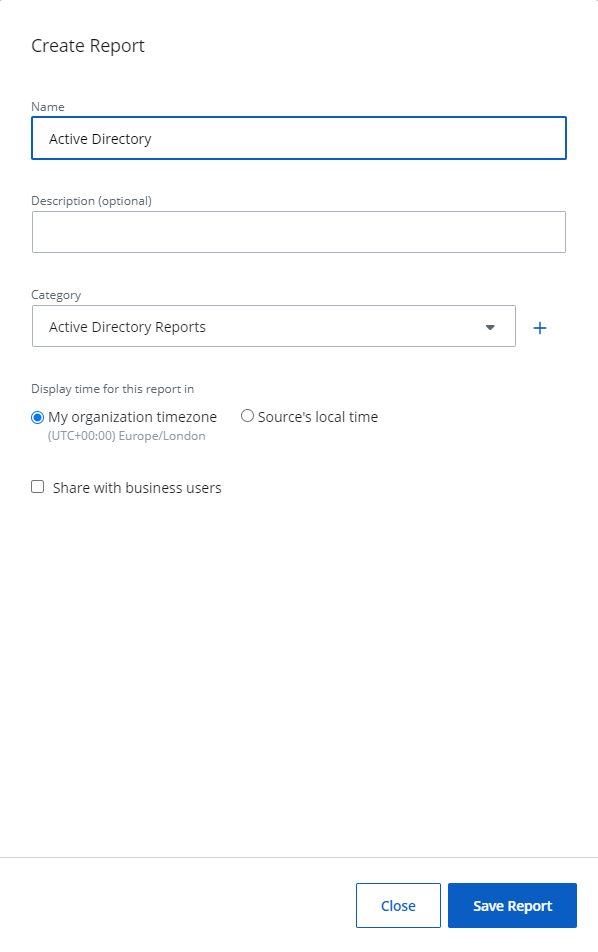

#  Custom Reports

You can define a filter set and create a custom report based on the filter so that you will not have to set it up next time.

## Create a Custom Report

Follow the steps to create a custom report. @Snippet:1Secure/Reports:ActivityReportNav@

 Select an organization from the drop-down menu at the top of the left pane to create a custom report for it. An organization is selected by default, but you can choose a different one if needed.

Define a filter criteria. See the [Apply Filters](ApplyFilters.md))  topic for additional information.

Click **Save as** in the upper right corner of the page. The Create Report pane is displayed.

In the Create Report pane, specify a name and description for the report in the Name and Description fields.

From the Category drop-down menu, select an existing category or add a new one for the report. The category is used to group related reports together.  
To add a new category, click the Add icon, specify a name, and click the Save icon. The new category is added.  

For Display time for this report in, select an option to display the time the report is generated.

- My Organization timezone – The timezone set for your organization
- Source's local time – Local time for your source obtained from the agent server. (Recommended when applying the Time of Day filter)

Optionally, select the **Share with business users** check box to share the report with business users. See the [Add the Business Viewer Role](../Organizations/AddingUsers.md#Adding2)  topic for additional information on shared reports. 

This check box is not available for End Customer Organizations. 

Click **Save Report**. 

Your custom report is created under the respective category.

You may link this report to an alert. See the [Add a Custom Alert](../Alerts/Alerts.md#Adding)  topic for additional information.

## Modify a Custom Report

Follow the steps to modify a custom report. @Snippet:1Secure/Reports:ActivityReportNav@ 
@Snippet:1Secure/Reports:ReportNavStep2@ 
@Snippet:1Secure/Reports:ReportNavStep3@ 
@Snippet:1Secure/Reports:OpenCustomReport@ 

Click **Edit** to modify the report. The Edit Report pane is displayed.

Modify the required information. See Step 5 through 8 in the [Create a Custom Report](#CreateGe))  topic for additional information.

Click **Save Report**.

## Delete a Custom Report

Follow the steps to delete a custom report. @Snippet:1Secure/Reports:ActivityReportNav@ 
@Snippet:1Secure/Reports:ReportNavStep2@ 
@Snippet:1Secure/Reports:ReportNavStep3@ 
@Snippet:1Secure/Reports:OpenCustomReport@

Click **Delete**. A dialog box is displayed, prompting you to confirm the action. Click **Delete**. 

The custom report is deleted from the system.