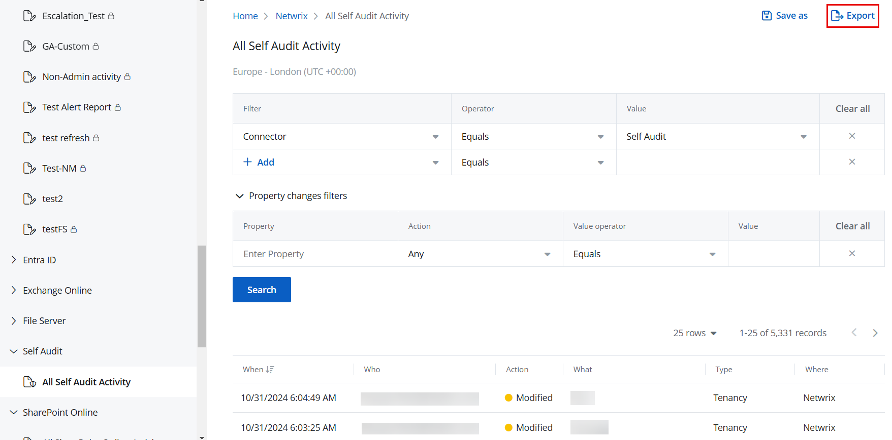

# Export a Report or Investigation Results

You can export the results of a new investigation or a report to a file for easier review. The exported report or investigation is sent to you as an .xlsx file by email.

A report or investigation can be exported with up to 2000 records. If the data exceeds this limit, only the top 2000 records will be included in the exported file.

## Export a Report

Follow the steps to export a report.

Navigate to any of the following:

- **Reports** &gt; **Activity** tab
- **Reports** &gt; **Compliance** tab
- **Reports** &gt; **Risks** tab
- **Reports** &gt; **System** tab @Snippet:1Secure/Reports:ReportNavStep2@ 
@Snippet:1Secure/Reports:ReportNavStep3@ 
@Snippet:1Secure/Reports:ReportNavStep4@

Click **Export**. The report is sent to you as an .xlsx file by email.

A report cannot be exported if no data is available for it. In this case, the Export button remains disabled.  

## Export an Investigation

Follow the steps to export the results of an investigation. @Snippet:1Secure/Reports:ActivityReportNav@ 
@Snippet:1Secure/Reports:ReportNavStep2@

Define a filter criteria, then click **Search** to generate the investigation results based on it. See the [Apply Filters](ApplyFilters.md)  topic for additional information.

Click **Export**. The investigation results report is sent to you as an .xlsx file by email.