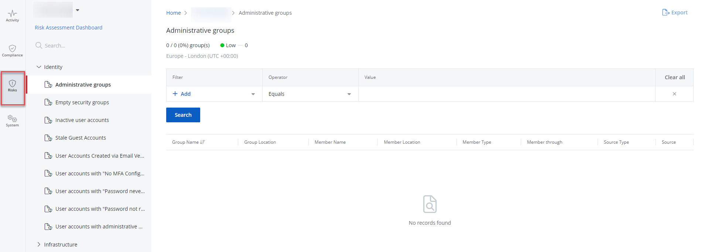
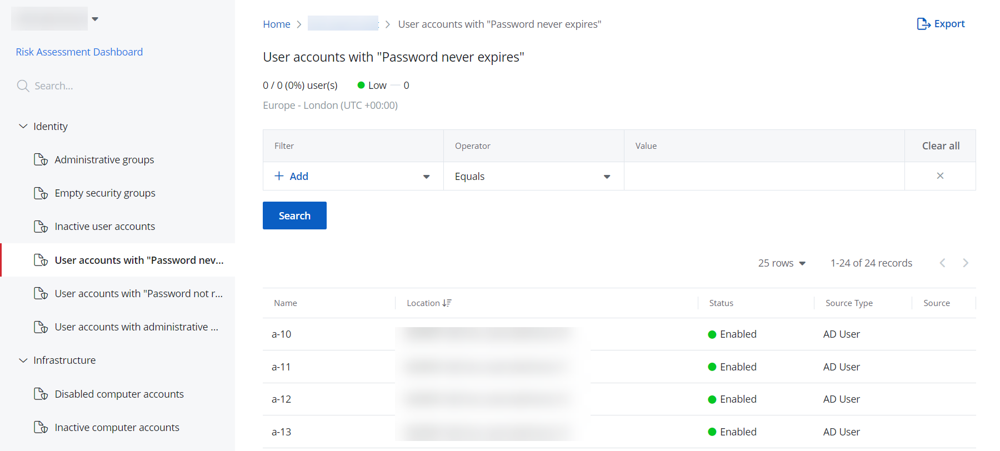

# State In Time Risks Reports

The state-in-time reports functionality allows generating reports on audited system  at a specific moment of time. State-in-time reports are based on the configuration snapshots captured by the product daily, and reflect a particular aspect of the audited environment.
For example, they show a number or statuses of inactive user accounts within the domain within the particular period. 

The  state-in-time reports collect data  from the following connectors:

- Active Directory State (AD State)
- Azure AD State

{{ MyVariables.ProductName_Overlord }}
allows to run the state-in-time reports from the risk-related data, displayed on your Risk Assessment Dashboard. See the [Review Risks using Risks Assessment Dashboard](../RiskProfiles/RiskAssessmentDashboard.md)  for additional information. 

You can run a report from a dashboard or from the **Reports** &gt; **Risks** tab. 

## Review a Report

Follow the steps to review a state-in-time report. 

Navigate to the **Reports** &gt; **Risks** tab.

Select your organization from the drop-down list at the upper left corner of the page. This will apply the related risk data audited for your organization. 

You can also click the Risk Assessment Dashboard to navigate to the risk details for your organization.  

Select the required risk report. 

On each report, you can view a status and measure of the risks. 

See the list of the available state-in-time reports below.

Identity: 

| Risk Name | Description |
| --- | --- |
| Administrative groups | Minimizing the number of administrative groups helps you understand and control the assignment of powerful permissions, as required for security and compliance. |
| Empty security groups | Empty security groups with administrative privileges are a potential back door for attackers. Regularly identify and delete empty groups. |
| Global Administrators | Lists global administrators within an environment. Regularly reviewing this report helps identify potential risks and ensures that only authorized personnel have elevated privileges. |
| Inactive user accounts | Inactive user accounts can be taken over and misused, so you should periodically identify and disable them, and then remove them. |
| Stale Guest Accounts | Any guest users that have not logged in for "X" days. By default, the accounts that have not logged in for 35 days are shown. You can filter this data. |
| User Accounts Created via Email Verified Self-Service Creation | User accounts created with self-service account creation. Self-service account creation when not strictly verified, can allow unauthorized individuals to gain access to an organization's systems. This can lead to unauthorized data access, leakage of sensitive information, and the establishment of footholds for further attacks within the network. |
| User accounts with "No MFA Configured" | User accounts which MFA is not configured with the admins of the organizations in {{ MyVariables.Azure_AD app }}. Without MFA, compromised credentials can lead directly to unauthorized entry, bypassing what is now considered a basic security standard. In the absence of MFA, even a strong password policy may not be sufficient to protect against phishing attacks and credential stuffing, which can lead to data breaches and system compromises. |
| User accounts with "Password never expires" | Enabled user accounts whose passwords never expire might be in violation of your organization's security policy. |
| User accounts with "Password not required" | Accounts that can be used to log on without a password are a high risk and require immediate attention. |
| User accounts with administrative permissions | Minimizing the number of users with administrative privileges reduces security risks and is required by many compliance mandates. |

Infrastructure: 

| Risk Name | Description |
| --- | --- |
| Disabled computer accounts | Disabled computers often lack current patches and antivirus software, making them easy targets for cyberattacks if they are re-enabled. Periodically identifying and deleting these accounts will reduce this risk. |
| Inactive computer accounts | Inactive computer accounts can be misused, so you should periodically identify and disable them, and then remove them. |

Apply the search filters if necessary and click **Search**. 

You can also export a report to your email by clicking **Export**  in the upper right corner of the page. You shall receive a report in XLSX/CSV to your login email. 

## Filter Descriptions

This table provides a list of filters and descriptions.

| Filter | Description |
| --- | --- |
| Group Location | Limits your search to a location of the administrative group, that share servers (for example, specific path). |
| Group name | Limits your search to a name of the administrative group. |
| Member location | Specify the location of the specific member within the administrative group (for example, Group A's Member name would be Admin Group, or Group B's Member name is Group C, and Group C's Member name is Admin Group). |
| Member name | Specify a name of the member for the administrative group.  Member Name is the name of the group, member location is where the group exists e.g. AdminGroup's full path may be /path/groups/users/AdminGroup, so its name is AdminGroup and its location is /path/groups/users/ |
| Member through | Specify whether a group is a member of a group explicitly or inherited from another group.  
                          For example, Group A &gt; Admin Group (Group A is explicitly a member of Admin Group) 
                          Group B &gt; Group C &gt; Admin Group (Group C is explicitly a member of Admin Group, Group B is an inherited member of Admin Group) 
                          If you do not specify the value, it will include both. If your Value is Inherited, it will only show Group B, and if you Value is Explicit, it will show Group A and Group C |
| Status | Specify Enabled or Disabled in Value column. This applies to a status of the user accounts. |
| Last login | Specify the date and time of the last user login to limit your search. |
| Source Type | Specify the source type of the user: <ul>
                             <li>
                                 
AD Group

                             </li>
                             <li>
                                 
Azure Group

                             </li>
                             <li>
                                 
Windows Local Group

                             </li>
                         </ul> |
| Source | Specify the source name, that you set up when adding the organization.  This value shall be retrieved from Source group name. |
| Name | Specify name of the user account or computer account (for example, account with "password not required" or a computer name in the "Disabled computer accounts" report) |
| Disabled | Limit your search to disabled accounts. |
| Path | Limits your search to a specific path. |
| Role | Limits your search to a specific role. |