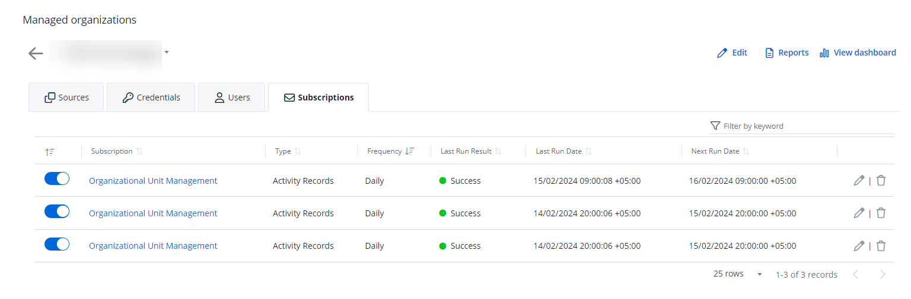

# Subscriptions

The Subscriptions feature allows Managed Service Providers (MSPs) to schedule certain reports (including Risk Assessment Dashboard reports), send them to specific email addresses automatically, or upload reports to a designated folder in SharePoint Online. This enables MSPs to:

- Carry out reporting obligations with the clients
- Store an audit trail for compliance purposes

A report delivered by subscription can contain up to 2000 records. If the data exceeds this limit, only the top 2000 records will be included in the subscribed report.

## Add a Subscription

Follow the steps to add a subscription. @Snippet:1Secure/Reports:ActivityReportNav@ @Snippet:1Secure/Reports:ReportNavStep2@ @Snippet:1Secure/Reports:ReportNavStep3@ @Snippet:1Secure/Reports:ReportNavStep4@

You cannot subscribe to a report if no data is available for it. In this case, the Subscribe button remains disabled.

Click **Subscribe** on the top right of the page. The Subscription to &lt;name of the report&gt; pane is displayed.

Set a start date, time, and time zone for sending the report to the intended recipients.

- Start Date    – Click the icon in this field to open a calender to select a date. You can also type a date in the field.
- Time    – Click the icon in this field to open a clock to select a time. You can also type a time in the field.
- Time Zone    – Select a timezone.

Select a  frequency for sending the reports from the Frequency drop-down menu. The available options are: Daily, Weekly, and Monthly. 

 You can view the subscription timing details in the footer of the pane.

In the Attached File field, specify the name of the file the intended recipients will receive. The default name is: Report on {{ '{{' }}Report\_Name{{ '}}' }} {{ '{{' }}Export\_Date{{ '}}' }}. These variables will be replaced with the report's name and date. For example, Report on Accounts Deleted 01/10/2025 09:00:00.

You can use other variables to specify the file name, as discussed in the following step.

From the Variables drop-down menu, select a variable to be used in the name of the file. @Snippet:1Secure/Reports:SubscribeVariables@

 Select a file format (XLSX, CSV) from the drop-down menu.

Click the **Send reports by email** check box to specify email delivery settings. The Email Settings section expands to display the following:

- Recipients – Specify  the email addresses of the recipients of the report subscription. You can enter multiple addresses separated by a comma.
- Email Subject – Specify the email subject. The default subject is: {{ '{{' }}Frequency{{ '}}' }} Report on {{ '{{' }}Report\_Name{{ '}}' }} from {{ '{{' }}Managed\_Organization{{ '}}' }}. These variables will be replaced with the report frequency, report name, and managed organization name. For example, Monthly Report on Accounts Deleted from Netwrix.

    You can use other variables to specify the subject line of the email, as discussed below.
- Variables – Select variable(s) to customize the subject line of the email. @Snippet:1Secure/Reports:SubscribeVariables@

    The End Customer Organization has the Organization Name variable instead of the Managed Organization and Managing Organization variables.
- Message – Enter the information to be included in the body of the email.

Click the **Upload reports to a designated folder in SharePoint Online** check box to specify the settings for SharePoint Online delivery. 

 If you encounter the message, Integration required, you must first configure your integration for SharePoint Online. See the [SharePoint Online](../../Integration/SharePointOnline.md)  topic for additional information. 

Expand the SharePoint Online Settings section and specify the following settings for saving the report:

- SharePoint Online Site URL – The URL of the SharePoint site (e.g. https://site.Sharepoint.com/sites/sitename)
- SharePoint Online Folder Path – The folder path in SharePoint, relative to the site URL (e.g. /Shared Documents/FolderName)

    For MSP organizations, reports will always be saved to the location in a sub-folder named after the child organization.

Click **Save Subscription**. 

The subscription is created. 

## Edit  a Subscription

Follow the steps to edit a subscription. @Snippet:1Secure/Organization:ManagedOrgNav@ @Snippet:1Secure/Organization:OrgSelectionNav@ @Snippet:1Secure/Organization:SubscriptionTab@ On this page, you can review statuses for your subscriptions in the Last run result column. It indicates the status for sending the reports or creating a subscription (New, Success, Error Processing, Error Sending). 

(Optional) To disable a subscription, toggle OFF the switch for it.

 Click the Edit icon for a subscription to modify it. The Subscription to &lt;*name of the report*&gt; pane is displayed.

Modify the required information. For details, refer to Steps 6 through 12 in the [Add a Subscription](/Admin/SearchAndReports/#Add)  topic.

Click **Save**.

## Delete a Subscription

Follow the steps to delete a subscription. @Snippet:1Secure/Organization:ManagedOrgNav@ @Snippet:1Secure/Organization:OrgSelectionNav@ @Snippet:1Secure/Organization:SubscriptionTab@

Click the Delete icon for a subscription to delete it.

A dialog box is displayed, prompting you to confirm the deletion of the subscription.

Click **Yes**.

The subscription is deleted.