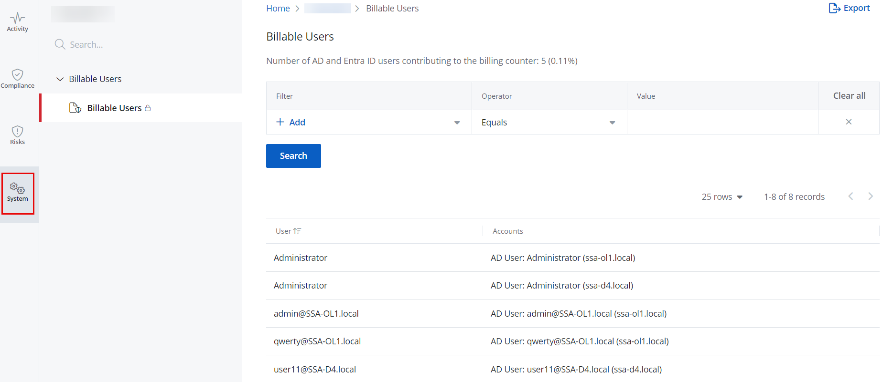

# System Reports

A System report named Billable Users is automatically generated and provides insights into your 1Secure tenant.

## Review Billable Users Report

Follow the steps to review the Billable Users report.

Navigate to the **Reports** &gt; **System** tab.

Select the **Billable Users** report in the left pane to view it.

This report lists the number of Active Directory and {{ MyVariables.Azure_AD app }} users contributing to the billing counter. @Snippet:1Secure/Reports:ReportSearch@
        
## Filter Descriptions

This table provides a list of filters with their description.

| Filter | Description |
| --- | --- |
| Account | Filters the report based on an account. 
                          To apply this filter, select **Account** from the **Filter** drop-down menu and specify an account name in the **Value** field. |
| Source Type | Filters the report based on a source type, that represents a platform where :a user currently exists: 
                         <ul>
                             <li>
                                 
AD User

                             </li>
                             <li>
                                 
Windows Local User

                             </li>
                             <li>
                                 
{{ MyVariables.Azure_AD app }} user

                             </li>
                         </ul>
                          To apply this filter, select **Source Type** from the **Filter** drop-down menu and choose an option from the **Value** drop-down menu. |
| User | Filters the report based on the name of a user. 
                          To apply this filter, select **User** from the **Filter** drop-down menu and specify a user name in the **Value** field. |