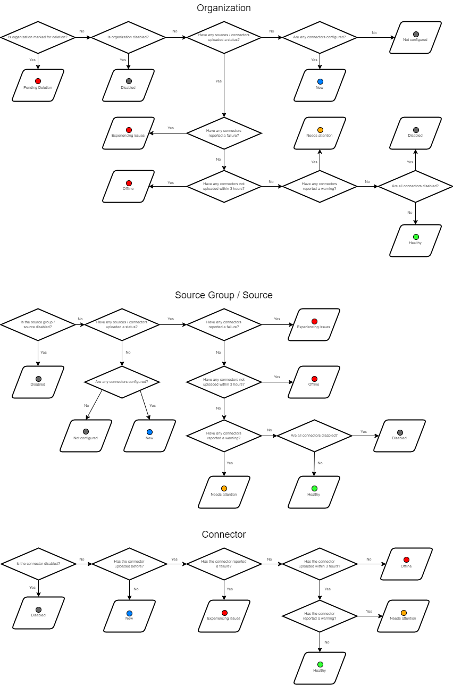

# Statuses 

Statuses in {{ MyVariables.ProductName_Overlord }} allow you check up the state of the system, specifically - sources, agent, and connectors. As you add your sources, connectors, install the agent, {{ MyVariables.ProductName_Overlord }} provides several statuses for these:

The New status changes to Healthy status when the agent finishes collection from the environment.  The time frame for a change may be within a minute up to several hours depending on the environment size.

You can also review the agent status while adding the organization. See the [Manage Organizations](Organizations/README.md)  topic for more information.