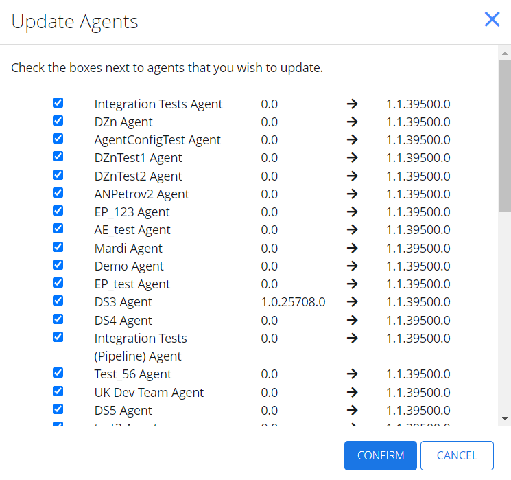
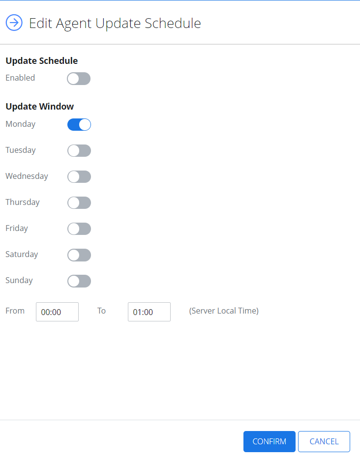
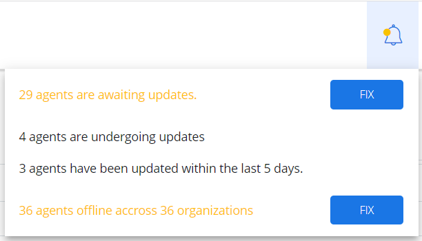
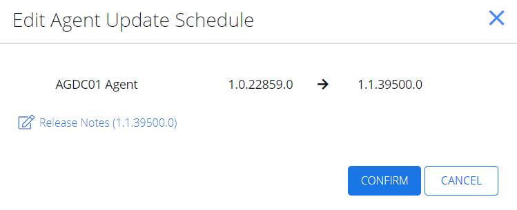

# Update Netwrix Cloud Agent

With {{ MyVariables.ProductName_Overlord }}, you can both update the version of the agent by installing new agent or using Self-update function. The Self-update saves your time from installing the new version repeatedly, while providing real-time notifications, managing agent schedule, and bulk update option. 

During the update process, your activity monitoring will not be disrupted.

| Icon | Description |
| --- | --- |
|    | Bell Icon. Click the Bell Icon to look up for  the available updates of the Netwrix Cloud Agent. |

## Update Agents in Bulk

Follow the steps to update agents in bulk.

To update selected agents, on the Managed Organizations page, select **Bulk Update Agent**.

On the Update Agents page, check the boxes next to agents you wish to update and click **Confirm**. 

The agents are now updated.

## Edit Agent Update Schedule

Follow the steps to update agent schedule. 

To edit the agent update schedule, on the Managed Organizations page, select **Agent Update Settings**. The Edit Agent Update Schedule page  displays.

In the Update Schedule section, select Enabled. 

In the Update Window section, configure the options to specify when you want the update to occur.

Select Confirm. 

The agent update schedule is now configured.

## Enable Self-Update Function 

Follow the steps to enable the self-update function .

To look up the available updates, click the **Bell** icon. The panel with available updates displays.

Click **Fix** for the agents to be updated. Now you can see the list of organizations and which agents may be updated to the new version.

Click **Update available** to update the agent to the current version. The Edit Agent Update Schedule page displays, offering you the proposed version.

Select **Confirm**. The agent shall update and upload a new .msi file of your agent. 

Alternately, update the version for an organization from the Managed organizations page. Select the **organization** and then the **Sites** tab.

Click Update. 

Toggle on Override Tenancy Defaults if you want to change the update defaults for that organization. 

Click Edit. 

On the Edit Agent Update Schedule window, select Enabled and apply the required parameters to specify when you want the update occur.

Click **Confirm**. 

The self-update function is now configured.

See the following topic for additional information:

- [Notifications](/Admin/Notifications.md) 