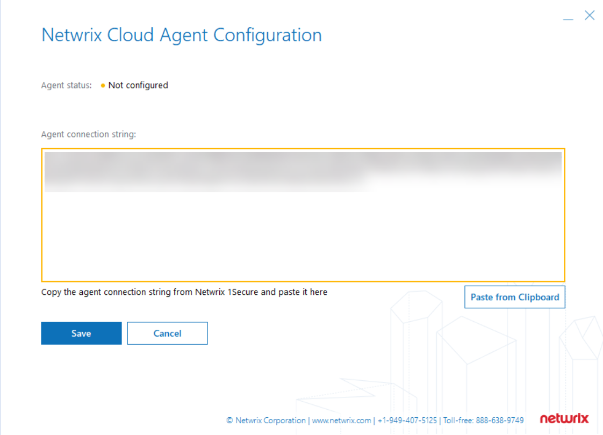
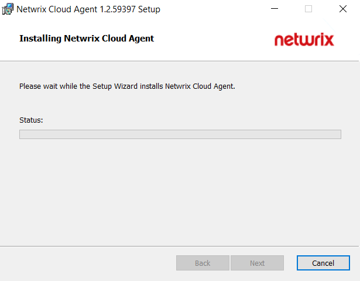

# Install Agent

This topic describes an installation of the agent for collecting the data from your sources. Prior to installing the agent, ensure that all installation requirements have been met. See the [Agent Software Requirements](../Requirements/CloudAgentRequirements.md)  topic for additional information.

## Configure Netwrix Cloud Agent

To collect the data from the Computer and Active Directory you will need to install and configure the Netwrix Cloud Agent. 

Follow the steps to configure an agent. 

In the {{ MyVariables.Website }}, go to Home page and select the Add organization icon to add an organization. Specify the name of the organization, timezone, country, and tags. 

Click **Save**. 

On the Agent Config panel, select **Download Agent** to start downloading agent for analyzing your data.

 Complete the [Install the Agent](/Install/#Install)  steps. Ensure you tick Launch Netwrix Cloud Agent Configuration tool and click Finish.

On the displayed Netwrix Cloud Agent Configuration screen, select Configure to configure with Netwrix Cloud Agent.

 Go back to your {{ MyVariables.ProductName_Overlord }} configuration panel and copy the agent connection details by selecting Copy Connection String. This information will be used for agent deployment.

 Paste the information in the Netwrix Cloud Agent Configuration that you copied earlier and save settings.

The agent status has changed to **Connected** (green). 

Go back to the {{ MyVariables.ProductName_Overlord }} configuration panel and select **Retry connecting to the client**. The agent status shall change to Healthy. 

## Install the Agent

Follow the steps to  install the agent.

Check the prerequisites.

Download the agent installer while adding the organization.

Click **Next** to continue.

Specify the installation folder and click **Next** to continue.

Click **Install**. The agent starts the installation process.

Keep the **Launch Netwrix Cloud Agent Configuration**  tool checkbox selected and click Finish to complete the setup.