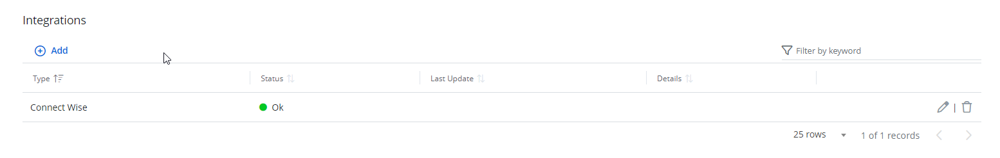

# ConnectWise

ConnectWise is a flexible platform for Managed Service Providers that provides integrated services. Integrated with {{ MyVariables.ProductName_Overlord }}, ConnectWise allows to deliver an alert as a ticket for help desk or tech services. In ConnectWise, you can create a Company and match with the Organization in {{ MyVariables.ProductName_Overlord }}. The tickets are delivered under the name of that company.

Image keys: 

| Icon | Description |
| --- | --- |
|    | Edit Icon. Click the Edit Icon to edit the  settings of the integration type. |
| | ConnectWise Icon. Click the ConnectWise icon to make the settings for the ConnectWise. |
|    | Bin Icon. Click the Bin icon to delete the ConnectWise integration |

## Add a ConnectWise Company in a System

Follow the steps to add a ConnectWise company in {{ MyVariables.ProductName_Overlord }}.

Go to **Configuration** &gt; **Integrations** and click the **Add** icon to add the ConnectWise company.

Click **ConnectWise** and then click **Next**.

In the Configure Connection window, enter information in the required fields.

First, you need to configure your account at [https://www.connectwise.com/](https://www.connectwise.com/ "https://www.connectwise.com/"). See the [ConnectWise Help/FAQs](https://virtualcommunity.connectwise.com/helphome/faq "ConnectWise Help/FAQs") page  for  additional information. 

- Company  URL – Enter when setting the public keys for the company at https://www.connectwise.com/
- Company ID – Company ID at [https://www.connectwise.com/](https://www.connectwise.com/ "https://www.connectwise.com/")
- Pubic key – Public key you specify at [https://www.connectwise.com/](https://www.connectwise.com/ "https://www.connectwise.com/")
- Private key – Private key you specify at [https://www.connectwise.com/](https://www.connectwise.com/ "https://www.connectwise.com/")

Click *Finish*.

The ConnectWise company is added now. The status displays "Ok" in green.

Use the Edit icon or the Bin icon to edit or delete the integration. 

## Manage Delivery Settings 

After adding your ConnectWise company, you can link it to your organization and manage delivery settings. 

Also, when you add a new organization, you can specify your ConnectWise company from the start. See the [Add Organizations](../Admin/Organizations/AddOrganizations.md)  topic for additional information. 

Follow the steps to manage delivery settings for ConnectWise.

Navigate to Configuration &gt; Alerts. 

 Click the ConnectWise icon under the Delivery Settings. The ConnectWise Delivery Settings pane is displayed.

Toggle on the Enabled button to enable the ConnectWise delivery. 

Set the default priority of raised tickets. 

Provide the corresponding ConnectWise Company ID for the required organization.

Click **Save**.

ConnectionWise delivery settings are configured.

## ConnectWise Manage Permissions

{{ GroupID.CompanyName }} has built a ready-to-use add-on that automates incident management, automatically creating service tickets for security alerts triggered by {{ MyVariables.ProductName_Overlord }}.

The add-on connects to the latest version of the ConnectWise Manage application by default. To connect to ConnectWise Manage via its REST API, you must have an API Member account, which is required to log in to ConnectWise Manage. See [this article](https://docs.connectwise.com/ConnectWise_Documentation/090/040/010/040) for additional information.

It is recommended to assign the API Member account to a limited security role with the following permissions:

- System – Table Setup – Inquire Level = All
- Companies – Company Maintenance – Add(all), Inquire(all)
- Companies – Manage Attachments – Add(all), Inquire(all)
- Service Desk – Service Tickets – Add(all), Inquire(all)