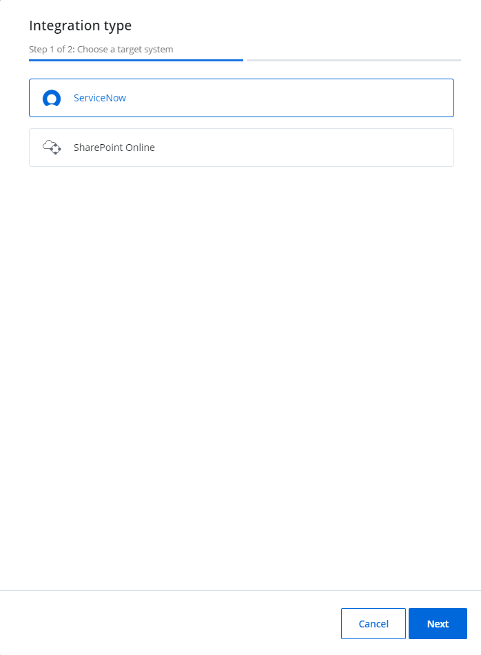
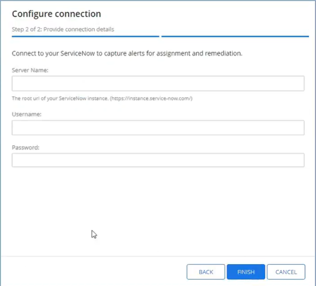
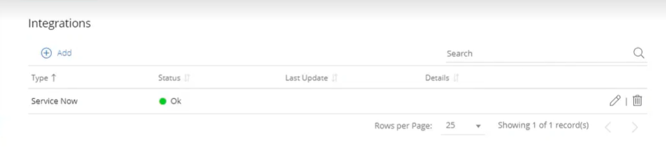
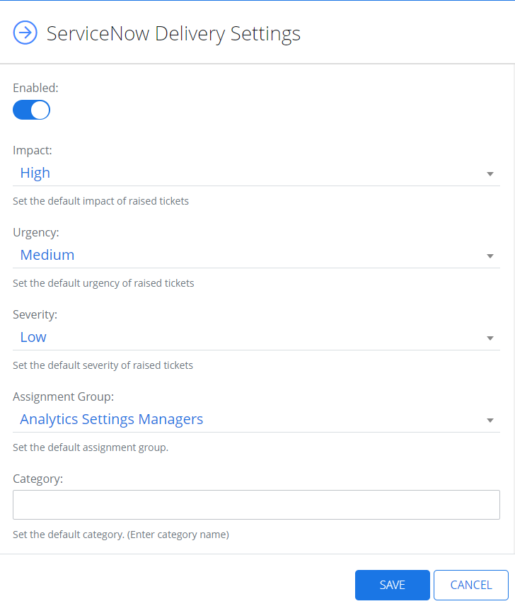

# ServiceNow

ServiceNow is a flexible platform for Managed Service Providers that provides integrated services. Integrated with {{ MyVariables.ProductName_Overlord }}, ServiceNow allows to deliver an alert as a ticket or a work note for help desk or tech services.  Once a ticket is created, it is assigned to an IT agent to be resolved. 

In ServiceNow, you can create a profile for your Managed Service Provider and then implement the delivery settings in {{ MyVariables.ProductName_Overlord }}. The tickets shall be delivered to specific assigned work group. 

Image keys:

| Icon | Description |
| --- | --- |
|    | Edit Icon. Click the Edit Icon to edit the  settings of the integration type. |
| | ServiceNow Icon. Click the ServiceNow icon to make the settings for  ServiceNow. |
|    | Bin Icon. Click the Bin icon to delete the ServiceNow integration |

## Add a ServiceNow Integration System

Follow the steps to add a ServiceNow integration system.

Go to Configuration &gt; **Integrations** and click the **Add** icon to add the system.

In the displayed Integration type window, click **ServiceNow** and click **Next**.

In the Configure connection window, specify the required boxes - Server Name, Username, and Password. 

First, you need to configure your account at [https://www.servicenow.com/](https://www.servicenow.com/ "https://www.servicenow.com/"). See the [https://docs.servicenow.com/en-US/bundle/vancouver-platform-administration/page/administer/users-and-groups/task/t_CreateAUser.html](https://docs.servicenow.com/en-US/bundle/vancouver-platform-administration/page/administer/users-and-groups/task/t_CreateAUser.html "https://docs.servicenow.com/en-US/bundle/vancouver-platform-administration/page/administer/users-and-groups/task/t_CreateAUser.html") help page for an additional information. 

View Fields Here:

- Server Name – The root url of your ServiceNow instance (https.//intance.service-now.com)
- Username - Username you create at [https://www.servicenow.com](https://www.servicenow.com/ "https://www.servicenow.com")/
- Password – Password you set up when creating a service account at [https://www.servicenow.com/](https://www.servicenow.com/ "https://www.servicenow.com/ ")

Click **Finish**. 

The ServiceNow profile is added now. The status displays "Ok" in green.

Click the **Edit** icon or the **Bin** icon to edit or delete the integration. 

## Manage Delivery Settings

Follow the steps to manage delivery settings for ServiceNow.

Navigate to **Configuration** &gt; **Alerts**.  

Click the Service Now icon\* under Delivery Settings. The ServiceNow Delivery Settings panel displays.

Specify the Assignment Group, which should receive the tickets. 

Toggle on the **Enabled** field to enable the ServiceNow delivery. 

Specify the required parameters, such as impact, severity, and urgency of raised tickets. 

Optionally, toggle on the **Work Notes** field to assign alerts detail to Work notes column in ServiceNow. See the [https://docs.servicenow.com/bundle/vancouver-servicenow-platform/page/administer/state-flows/concept/c_WorkNotes.html](https://docs.servicenow.com/bundle/vancouver-servicenow-platform/page/administer/state-flows/concept/c_WorkNotes.html "https://docs.servicenow.com/bundle/vancouver-servicenow-platform/page/administer/state-flows/concept/c_WorkNotes.html") topic for additional information. 

Optionally, toggle on the **Comments** field to specify the alerts detail in the Comments column in ServiceNow. 

Click **Save**.

The user account configured for the integration must have the Information technology infrastructure library (ITIL) role assigned to it in ServiceNow.  Users without this role are unable to assign urgency/severity to an incident.

 See the [https://www.servicenow.com/products/itsm/what-is-itil.htm](https://www.servicenow.com/products/itsm/what-is-itil.html "https://www.servicenow.com/products/itsm/what-is-itil.htm") article for additional information.