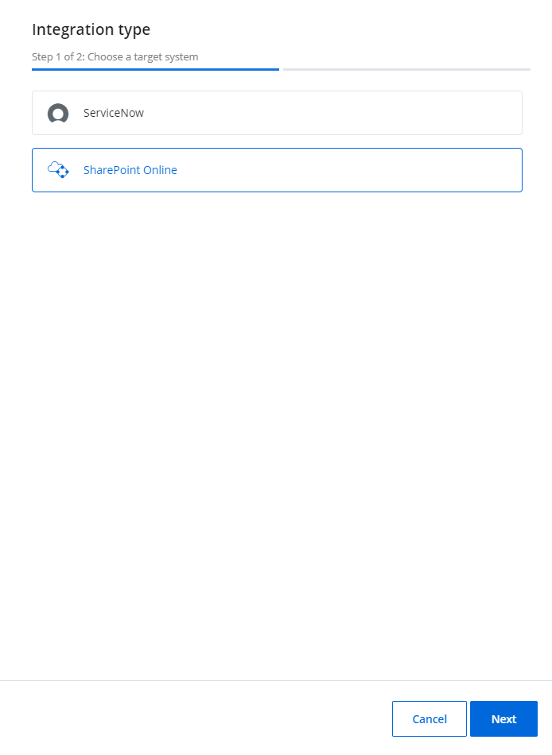
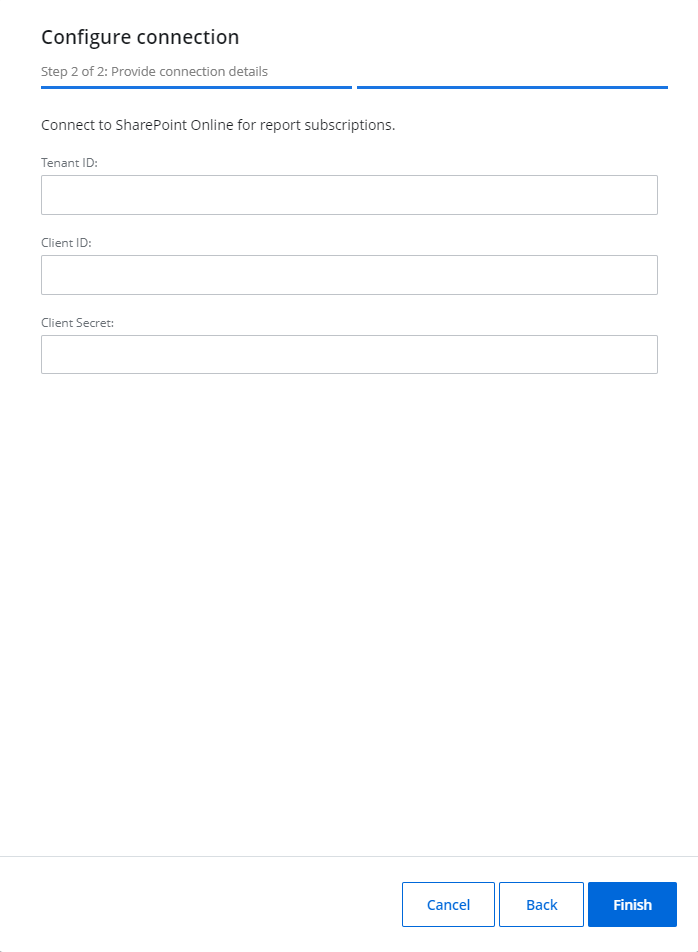
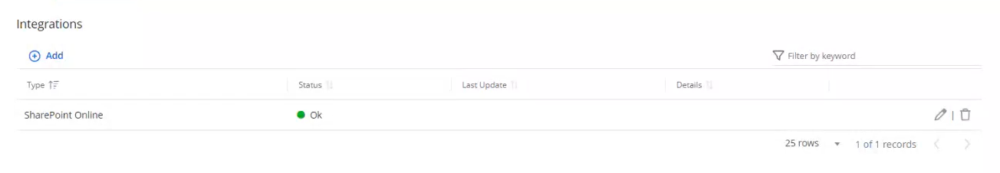

# SharePoint Online

You can use the SharePoint Online integration for the report (Activity and Risk Assessment Dashboard) subscriptions. This way, the required reports shall be delivered to a specific folder in SharePoint Online. 

| Icon | Description |
| --- | --- |
|    | Edit Icon. Click the Edit Icon to edit the  settings of the integration type. |
| | Bin Icon. Click the Bin icon to delete the SharePoint Online integration. |

## Add a SharePoint Online Integration in a System

Follow the steps to add the SharePoint Online integration in {{ MyVariables.ProductName_Overlord }}.

Go to Configuration &gt; **Integrations** and click the **Add** icon to add the SharePoint integration.

In the displayed Integration type window, click **SharePoint Online** and click **Next**.

In the Configure connection window, specify the required fields:

- Client ID – @Snippet:1Secure/EntraIDApp:ClientID@
- Tenant ID – @Snippet:1Secure/EntraIDApp:TenantID@
- Client Secret – @Snippet:1Secure/EntraIDApp:ClientSecret@

See the [App Registration and Configuration in Microsoft Entra ID](../Configuration/EntraID/RegisterConfig.md)  topic for additional information.

Click **Finish**. 

You must firstly add a Sites.ReadWrite.All permission in your {{ MyVariables.Azure_AD_admin_center }}. See the [Microsoft 365 Required Permissions](../Configuration/EntraID/Permissions.md#Grant Permissions to the Registered Application)  topic for additional information. 

The SharePoint Online integration is added now. The status displays "Ok" in green.

You can click the **Edit** icon or the **Bin** icon to edit or delete the integration. 

See the [Review Risks using Risks Assessment Dashboard](../Admin/SearchAndReports/Subscriptions.md)  topics to learn how to add subscriptions and deliver it to SharePoint Online folder.